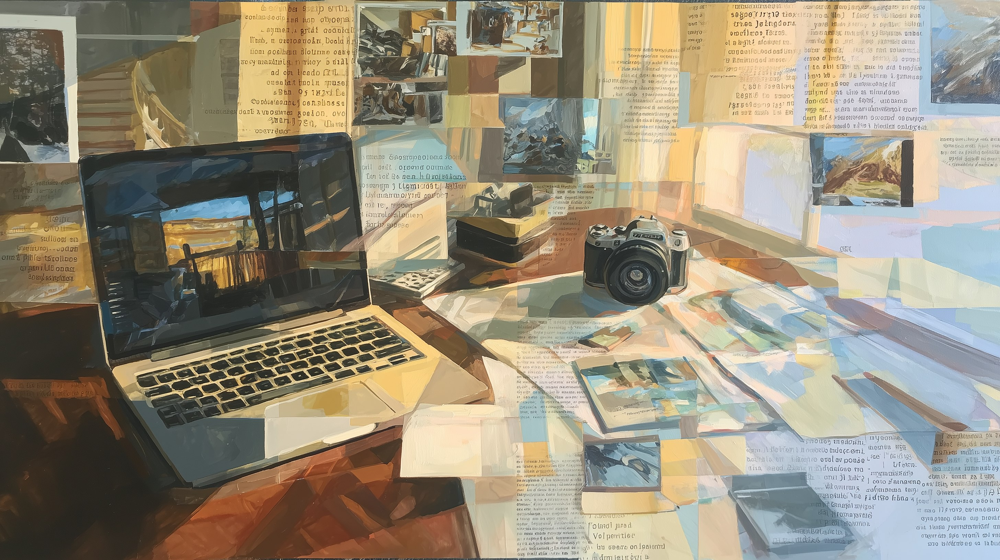

# PhotoShell Design System

Aesthetic reference: **DaVinci Resolve** — dark, dense, information-rich, professional.
Not Lightroom (too much whitespace), not a Bootstrap template (too generic).



## Color Palette

```
ROLE              CSS VARIABLE          HEX        USAGE
─────────────────────────────────────────────────────────────
App background    --ps-bg               #141414    Page body
Panel surface     --ps-surface          #1e1e1e    Sidebar, cards, panels
Hover surface     --ps-surface2         #272727    Hover states, elevated
Active surface    --ps-surface3         #303030    Pressed, active selections
Accent            --ps-accent           #d4845e    Primary actions, focus rings
Accent hover      --ps-accent-hover     #e09570    Accent hover state
Accent muted      --ps-accent-muted     #d4845e33  Subtle accent backgrounds (20%)
Primary text      --ps-text             #e0e0e0    Body text, headings
Secondary text    --ps-text-muted       #888888    Labels, descriptions
Disabled text     --ps-text-dim         #555555    Disabled, tertiary
Border            --ps-border           #333333    Dividers, panel borders
Success           --ps-success          #6b9b6b    Completed steps, good states
Warning           --ps-warning          #c9a227    Warnings, partial states
Danger            --ps-danger           #c45555    Errors, failures
```

### Color Rules
- No shadows. DaVinci Resolve uses 1px borders, not box-shadow. Flat is intentional.
- Hover states: `rgba(255,255,255,0.04)`. Active: `rgba(255,255,255,0.08)`.
- Accent is warm amber — darkroom warmth, not startup-orange.
- WCAG AA contrast verified: `#e0e0e0` on `#141414` = 13.5:1. `#888` on `#141414` = 5.5:1.

## Spacing

8px base grid. All spacing is a multiple of 4px.

```
TOKEN             CSS VARIABLE          SIZE
──────────────────────────────────────────────
Extra small       --ps-space-xs         4px
Small             --ps-space-sm         8px
Medium            --ps-space-md         12px
Large             --ps-space-lg         16px
Extra large       --ps-space-xl         24px
2x large          --ps-space-2xl        32px
```

### Spacing Rules
- Minimum gap between elements: 4px
- Section gaps: 12px
- Panel padding: 12px (compact), 16px (standard)
- Sidebar item padding: 8px 12px

## Typography

```
ROLE              FONT                           SIZE    WEIGHT  LINE-HEIGHT
─────────────────────────────────────────────────────────────────────────────
UI chrome         Inter, system-ui, sans-serif   13px    400     1.4
UI labels         Inter, system-ui, sans-serif   12px    600     1.4
UI heading        Inter, system-ui, sans-serif   14px    600     1.4
Page title        Inter, system-ui, sans-serif   16px    700     1.4
Metadata/code     JetBrains Mono, Cascadia Code  12px    400     1.6
Log panel         JetBrains Mono, Cascadia Code  12px    400     1.6
Badges            Inter, system-ui, sans-serif   11px    600     1.0
```

### Typography Rules
- Load Inter + JetBrains Mono via CDN (Google Fonts).
- Never use font-size below 11px.
- Metadata and file paths always use monospace.

## Border Radii

```
TOKEN             CSS VARIABLE          SIZE    USAGE
──────────────────────────────────────────────────────
Small             --ps-radius-sm        3px     Badges, tags, small elements
Medium            --ps-radius-md        6px     Panels, inputs, buttons
Large             --ps-radius-lg        8px     Modals, dialogs
```

## Transitions

```
TYPE              DURATION    EASING                           USAGE
────────────────────────────────────────────────────────────────────────
Hover             150ms       ease                             Background, color changes
Expand/collapse   250ms       cubic-bezier(0.2, 0, 0, 1)      Panels, sections, drawers
Fade              200ms       ease-out                         Opacity changes, toasts
Pulse (running)   1.5s        ease-in-out (infinite)           Pipeline running state
```

## Layout

### Desktop (>960px): Sidebar + Main

```
┌─────────────────────────────────────────────────────────────┐
│  HEADER BAR (56px, fixed top)                               │
│  [icon] PhotoShell │ /path/to/photos │ 247 photos │ 82% GPS │
├────────────┬────────────────────────────────────────────────┤
│  SIDEBAR   │  MAIN CONTENT                                  │
│  300px     │  (flex: 1)                                     │
│  fixed     │                                                 │
│  overflow-y│  Pipeline view (48px strip)                    │
│  auto      │  Active step config (inspector panel)          │
│            │  Content view (thumbnails / map / blur)        │
│            │  Log panel (collapsible, 300px default)        │
└────────────┴────────────────────────────────────────────────┘
```

### Tablet (768-960px): Icon sidebar
- Sidebar collapses to 48px icon strip
- Hover/click expands to full 300px overlay

### Mobile (<768px): Full-width
- No sidebar — bottom tab bar with [Steps] [Map] [Log]
- Step config is full screen when selected
- Thumbnails in 2-column grid

### Sidebar Contents (top to bottom)
1. Folder path (truncated, click to browse)
2. Step checklist (checkboxes + step names)
3. Preset dropdown + save button
4. Run button (primary, full width)
5. Undo button (secondary, full width)
6. Keyboard shortcuts reference (dimmed, bottom)

## Components

### Pipeline View (48px strip above main content)
- Rounded rectangles: 120×32px, step name inside
- Status icon left: ○ pending, ◉ running (pulsing), ✓ done, ✗ error
- Count badge right: "42" (files processed)
- Connected by thin lines (1px --ps-border)
- Running node: background `--ps-accent-muted`, pulsing animation

### Thumbnail Grid
- Item size: 120×80px (3:2 aspect ratio, matching photo standard)
- Gap: 8px
- Hover: 2px accent border, slight scale(1.02)
- Blur score badge: bottom-right corner, monospace, semi-transparent bg
- RAW files: file-type icon placeholder (camera icon + format label)
- Lazy loaded via IntersectionObserver

### Map View
- OpenStreetMap tiles (street view only, no satellite toggle)
- Marker clusters (Leaflet.markercluster)
- Marker colors: by camera model (auto-assigned from a warm palette)
- Click marker: tooltip with thumbnail (120px) + filename + date + camera
- GPS coverage banner at top: "38 of 200 photos have GPS coordinates"

### Log Panel
- Background: #0f0f0f (darker than app bg)
- Line numbers: dim gray (#444), right-aligned, 3-char wide
- Font: JetBrains Mono 12px
- Auto-scroll to bottom (with "scroll lock" indicator if user scrolls up)
- Step headers: bright accent color, bold

### Blur Before/After
- CSS clip-path slider (no JS library)
- Draggable divider: 2px white line with circle handle
- Filmstrip below: horizontal scroll of scene photos (80×53px thumbnails)
- Selected frame highlighted with accent border
- Blur score overlaid on each filmstrip thumb

### Toast Notifications
- Position: bottom-right, 48px from edges
- Slide up animation (250ms)
- Auto-dismiss: 4s
- Background: --ps-surface2
- Left border: 3px solid (accent for success, danger for error, warning for warning)
- Max 3 visible, older ones collapse

### Drag-and-Drop Zone
- Visible when dragging over the page
- Full-page overlay with dashed border (2px dashed --ps-accent)
- Center text: "Drop folder here"
- Background: rgba(212, 132, 94, 0.08)

## Interaction States

```
FEATURE              | LOADING              | EMPTY                | ERROR                | SUCCESS
---------------------|----------------------|----------------------|----------------------|---------------------
Thumbnail grid       | Skeleton gray boxes  | "No photos" + browse | Broken icon + tooltip| Grid with badges
Map view             | Spinner overlay      | "No GPS data" banner | "Map unavailable"    | Clustered markers
Pipeline flowchart   | Gray nodes           | Shows enabled steps  | Red node with ✗      | Green nodes with ✓
Blur before/after    | Spinner              | "Run blur first"     | "File not found"     | Slider comparison
Preset dropdown      | N/A                  | "No presets" hint    | Toast error          | Populated dropdown
Undo button          | Spinner + text       | Disabled (grayed)    | Toast error          | Toast confirmation
Log panel            | "Waiting..."         | "Run workflow..."    | Red error lines      | "✓ All steps done"
Multi-folder         | Per-folder progress  | "No subfolders"      | Red badge on failed  | All folders green
```

## Accessibility

- All interactive elements: visible focus ring (2px solid --ps-accent)
- Sidebar step list: `<ul role="listbox">` with `aria-selected`
- Pipeline nodes: `aria-label` with status ("GPS Fill: completed")
- Color contrast: WCAG AA minimum for all text/background combos
- Minimum touch target: 44×44px
- Skip-to-main-content link
- Keyboard shortcuts: R (run), Esc (cancel), 1-9 (toggle steps), / (focus path)
  - Disabled when focus is in text input/textarea
