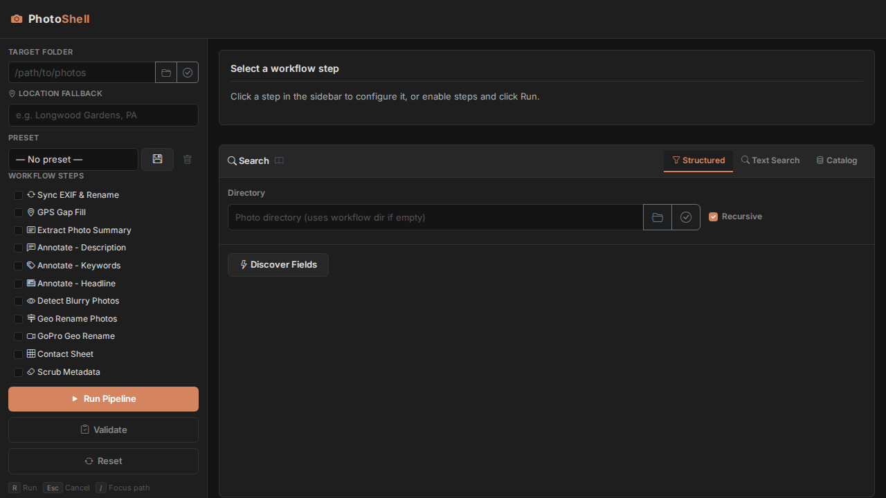
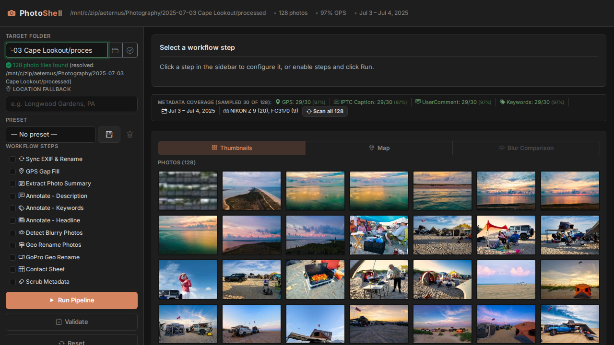
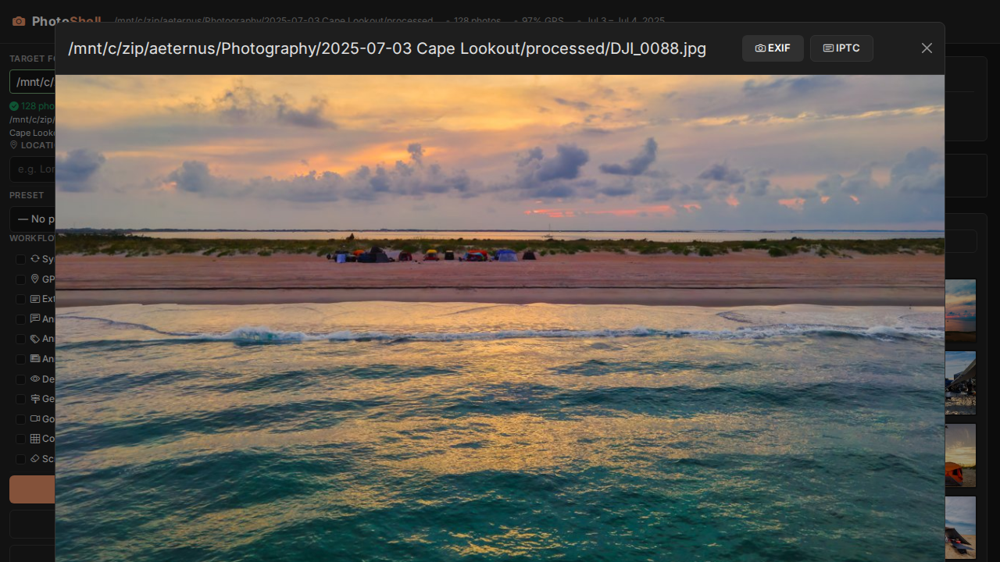
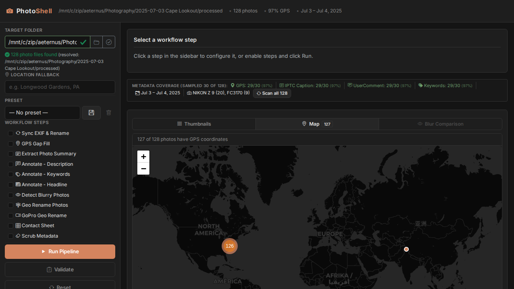
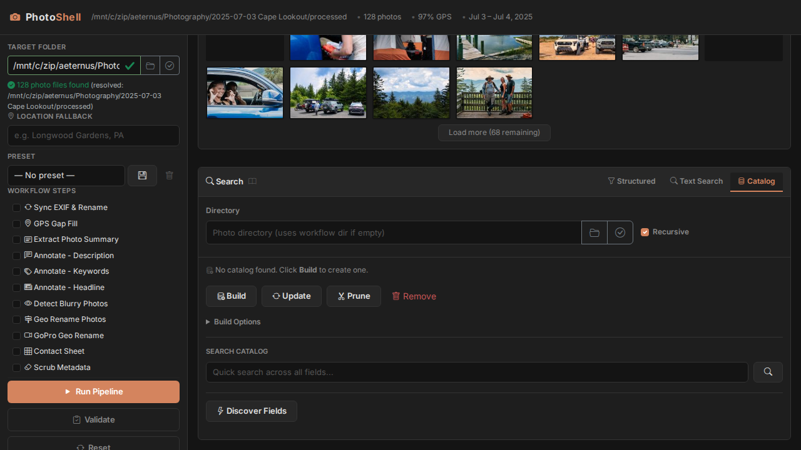

# Quick Start Guide

Get PhotoShell running in 10 minutes: install dependencies, clone the repo, start the web UI, and process your first batch of photos.

---

## 1. System Requirements

| Component | Minimum | Recommended |
|-----------|---------|-------------|
| OS | Windows 10/11 (WSL2), macOS 12+, Ubuntu 22.04+ | Same |
| RAM | 8 GB | 16 GB+ |
| Disk | 500 MB (tools) + space for your photos | SSD recommended |
| GPU (for Ollama) | 6 GB VRAM (4B models) | 12+ GB VRAM (12B/27B models) |

**No GPU?** PhotoShell works fine without Ollama — you just skip the AI annotation steps (Description, Keywords, Headline). Everything else (GPS fill, blur detection, rename, search, catalog) runs on CPU.

---

## 2. Install Dependencies

### Windows (WSL2)

Open PowerShell as Administrator and install WSL:
```powershell
wsl --install -d Ubuntu
```
Then open the Ubuntu terminal and follow the Linux instructions below.

### macOS

```bash
brew install exiftool imagemagick sqlite3 jq curl git python3
```

### Ubuntu / Debian

```bash
sudo apt update
sudo apt install -y exiftool imagemagick sqlite3 jq curl git python3 python3-pip python3-venv
```

### Fedora / RHEL

```bash
sudo dnf install -y perl-Image-ExifTool ImageMagick sqlite jq curl git python3 python3-pip
```

### Verify

```bash
exiftool -ver       # should print 12.x+
convert --version   # ImageMagick
sqlite3 --version
python3 --version   # 3.8+
```

---

## 3. Install Ollama (Optional — for AI Annotation)

Ollama runs AI models locally to generate photo descriptions, keywords, and headlines. Download from **https://ollama.com/download** for your platform.

Quick install on Linux:
```bash
curl -fsSL https://ollama.com/install.sh | sh
```

Start the server:
```bash
ollama serve
```

Pull a vision model (needed to analyze photos):
```bash
# Small — runs on 6 GB VRAM GPUs (fast, less detailed)
ollama pull gemma3:4b

# Medium — runs on 8-12 GB VRAM GPUs (good balance)
ollama pull gemma3:12b

# Large — runs on 16+ GB VRAM GPUs (most detailed)
ollama pull gemma3:27b
```

**What do 4B/12B/27B mean?** These are the number of *parameters* (billions) in the model. More parameters = better understanding of images and more nuanced descriptions, but requires more GPU memory and runs slower. Start with `4b` if your GPU has limited VRAM.

Browse all available vision models at **https://ollama.com/search?c=vision**.

For full Ollama documentation see **https://docs.ollama.com/quickstart**.

---

## 4. Clone and Start

```bash
git clone https://github.com/igoros777/photoshell.git
cd photoshell/ui/flask
pip install -r requirements.txt
python3 app.py
```

Open **http://localhost:5050** in your browser. You should see:



---

## 5. Your First Workflow

### Step 1: Select a folder

Type or paste a photo folder path in the **Target Folder** field, then click the checkmark button (or press `V`). PhotoShell validates the folder, shows a photo count, and loads thumbnails.



- **Thumbnails tab** — browse your photos visually
- **Map tab** — see photo locations on a dark-themed map (requires GPS data)
- **Blur Comparison tab** — compare blurry vs sharp photos after running blur detection

### Step 2: Enable workflow steps

Check the steps you want to run in the sidebar. Common workflow:

1. **GPS Gap Fill** — copies GPS coordinates from nearby photos to fill gaps
2. **Extract Photo Summary** — writes camera/lens/location info to metadata
3. **Annotate - Description** — AI-generated captions (requires Ollama)
4. **Annotate - Keywords** — AI-generated tags (requires Ollama)
5. **Annotate - Headline** — short title for stock/catalog use (requires Ollama)
6. **Detect Blurry Photos** — scores sharpness, groups scenes, picks the best

Click any step name to configure its options in the inspector panel.

### Step 3: Run

Click **Run Pipeline** (or press `R`). Watch the log panel for real-time progress. Steps light up green as they complete.

### Step 4: Explore results

Click any thumbnail to preview it full-size. Use the **EXIF** and **IPTC** buttons to view all metadata:



Switch to the **Map** tab to see where your photos were taken:



---

## 6. Photo Catalog

For large collections, build a SQLite catalog for instant searching across thousands of photos.

1. Scroll down to the **Search** panel and click the **Catalog** tab
2. Enter your top-level photo directory
3. Click **Build** to index all photos (progress bar shows real-time status)
4. Use **quick search** (free text across all fields) or **Discover Fields** for structured filters



**Catalog modes:**
- **Build** — full scan, creates or replaces the catalog
- **Update** — incremental, only indexes new files
- **Prune** — removes entries for deleted files
- **Remove** — deletes the catalog database

---

## 7. CLI Scripts (No UI Required)

Every workflow step is also a standalone bash script. Use them from the command line:

```bash
# Fill missing GPS from nearby photos
bash scripts/gps_gap_fill.sh /path/to/photos

# Detect blur and pick sharpest per scene
bash scripts/detect_blurry_photos.sh -i /path/to/photos --mode all

# Generate AI descriptions
bash scripts/annotate_photos_with_ollama.sh --description /path/to/photos

# Generate AI keywords
bash scripts/annotate_photos_with_ollama.sh --keywords /path/to/photos

# Generate AI headlines (Adobe Stock-optimized prompts available)
bash scripts/annotate_photos_with_ollama.sh --headline --prompt-id 2 /path/to/photos

# Rename photos with date/location/camera
bash scripts/geo_rename_photos.sh --structure daily /path/to/photos

# Build a metadata catalog for fast searching
bash scripts/catalog_build.sh -m build /path/to/photos
```

---

## 8. Keyboard Shortcuts

| Key | Action |
|-----|--------|
| `R` | Run pipeline |
| `Esc` | Cancel running pipeline |
| `/` | Focus the folder path input |
| `V` | Validate workflow |
| `?` | Open help documentation |

---

## Troubleshooting

**"exiftool: command not found"** — Install ExifTool. On Ubuntu: `sudo apt install exiftool`. On macOS: `brew install exiftool`.

**"Ollama not available"** — Make sure `ollama serve` is running in a separate terminal. PhotoShell auto-detects Ollama and disables AI steps if it's not running.

**Thumbnails don't load** — The thumbnail endpoint needs read access to the photo files. Make sure the Flask process can access the directory.

**Map shows no markers** — Your photos may lack GPS data. Run **GPS Gap Fill** first if you have a mix of GPS and non-GPS cameras.

**Catalog build seems slow** — Normal for large collections. 1000 photos takes ~30 seconds, 10000 photos takes ~5 minutes. The progress bar shows real-time status.

---

For full documentation, see [`README.md`](README.md), [`ARCHITECTURE.md`](ARCHITECTURE.md), and the per-script docs in [`docs/`](docs/).
