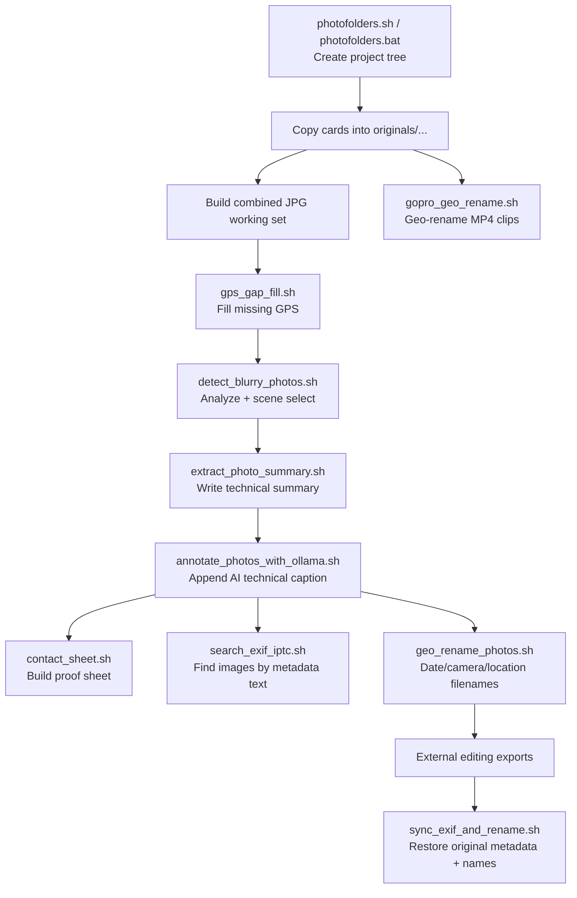

# PhotoShell
PhotoShell is a practical Bash toolkit for photographers who need fast, repeatable metadata workflows on local files.

It focuses on common archive-cleanup tasks such as repairing missing GPS tags, generating standardized metadata summaries, and renaming photos/videos into searchable, context-rich filenames.

The scripts are designed for batch processing in a working directory and are built around `exiftool` and a small set of standard CLI utilities.

And in case you like photography, here are some of mine: https://fieldexposure.com/


## Example Workflow: Back From A Trip (Mixed GPS + Non-GPS Cameras)
Scenario:
- Cameras used: iPhone + DJI drone + GoPro (GPS-capable), Fujifilm X-T3 + Nikon D750 (limited/no GPS).
- Goal: keep untouched originals, build a working set, fill GPS gaps, cull, annotate, rename, and prepare exports.

```bash
# repo checkout location
PHOTOSHELL="$HOME/src/photoshell"

# project location
PROJECT="2026-02_iceland_ring_road"
ROOT="$HOME/Pictures/Photography"
PROJECT_DIR="$ROOT/$PROJECT"
```

1. Create the project folder tree.
```bash
bash "$PHOTOSHELL/scripts/photofolders.sh" "$PROJECT" --root "$ROOT"
# Windows alternative:
# scripts\photofolders.bat "%PROJECT%" --root "D:\Photos"
```

2. Ingest cards into `originals/...` folders (example copy targets).
```bash
rsync -av /media/cards/FUJI/ "$PROJECT_DIR/originals/photo_cameras/X-T3/photos/raw/"
rsync -av /media/cards/NIKON/ "$PROJECT_DIR/originals/photo_cameras/D750/photos/raw/"
rsync -av /media/phone/DCIM/ "$PROJECT_DIR/originals/cell_phones/iPhone/photos/jpg/"
rsync -av /media/dji/DCIM/ "$PROJECT_DIR/originals/drones/DJI/photos/jpg/"
rsync -av /media/gopro/DCIM/ "$PROJECT_DIR/originals/video_cameras/GoPro/videos/original/"
```

3. Build one JPEG working timeline across cameras (so GPS-capable files can donate coordinates).
```bash
mkdir -p "$PROJECT_DIR/processed/photos/working/all_cameras_jpg"
rsync -av "$PROJECT_DIR/originals/photo_cameras/X-T3/photos/jpg/" "$PROJECT_DIR/processed/photos/working/all_cameras_jpg/"
rsync -av "$PROJECT_DIR/originals/photo_cameras/D750/photos/jpg/" "$PROJECT_DIR/processed/photos/working/all_cameras_jpg/"
rsync -av "$PROJECT_DIR/originals/cell_phones/iPhone/photos/jpg/" "$PROJECT_DIR/processed/photos/working/all_cameras_jpg/"
rsync -av "$PROJECT_DIR/originals/drones/DJI/photos/jpg/" "$PROJECT_DIR/processed/photos/working/all_cameras_jpg/"
```

4. Fill missing GPS from nearest-in-time donor photos.
```bash
cd "$PROJECT_DIR/processed/photos/working/all_cameras_jpg"
bash "$PHOTOSHELL/scripts/gps_gap_fill.sh" --dry-run
bash "$PHOTOSHELL/scripts/gps_gap_fill.sh"
```

5. Cull blur and keep the sharpest frame per scene.
```bash
bash "$PHOTOSHELL/scripts/detect_blurry_photos.sh" \
  --mode all \
  --input "$PROJECT_DIR/processed/photos/working/all_cameras_jpg" \
  --analyzed-dir "$PROJECT_DIR/processed/photos/working/blur_analyzed" \
  --scenes-dir "$PROJECT_DIR/processed/photos/working/scenes" \
  --selected-dir "$PROJECT_DIR/processed/photos/working/selected" \
  --time-gap 8 \
  --visual-threshold 0.12 \
  --clean
```

6. Write concise EXIF/IPTC summaries, then enrich with Ollama.
```bash
export GEOCODIO_API_KEY="YOUR_GEOCODIO_API_KEY"
find "$PROJECT_DIR/processed/photos/working/selected" -maxdepth 1 -type f \( -iname "*.jpg" -o -iname "*.jpeg" \) -print0 | \
  xargs -0 -I{} bash "$PHOTOSHELL/scripts/extract_photo_summary.sh" "{}"

bash "$PHOTOSHELL/scripts/annotate_photos_with_ollama.sh" \
  -r \
  -m gemma3:27b \
  "$PROJECT_DIR/processed/photos/working/selected"
```

7. Generate a proof sheet and search metadata text.
```bash
bash "$PHOTOSHELL/scripts/contact_sheet.sh" \
  -s "$PROJECT_DIR/processed/photos/working/selected" \
  -t 320 \
  --theme dark \
  -o "$PROJECT_DIR/processed/photos/exports/web/contact_sheet_trip.jpg"

bash "$PHOTOSHELL/scripts/search_exif_iptc.sh" \
  -q "waterfall" \
  -f "Caption-Abstract,UserComment,Keywords" \
  -m image \
  "$PROJECT_DIR/processed/photos/working/selected"
```

8. Rename photos and GoPro videos with timestamp/location-rich names.
```bash
cd "$PROJECT_DIR/processed/photos/working/selected"
bash "$PHOTOSHELL/scripts/geo_rename_photos.sh" --structure daily --dry-run
bash "$PHOTOSHELL/scripts/geo_rename_photos.sh" --structure daily

cd "$PROJECT_DIR/originals/video_cameras/GoPro/videos/original"
bash "$PHOTOSHELL/scripts/gopro_geo_rename.sh"
```

9. After editing exports, sync metadata from originals and rename exports to source-aligned names.
```bash
bash "$PHOTOSHELL/scripts/sync_exif_and_rename.sh" \
  "$PROJECT_DIR/processed/photos/exports/full" \
  --orig-dir "$PROJECT_DIR/originals/photo_cameras/X-T3/photos/raw" \
  --dry-run

bash "$PHOTOSHELL/scripts/sync_exif_and_rename.sh" \
  "$PROJECT_DIR/processed/photos/exports/full" \
  --orig-dir "$PROJECT_DIR/originals/photo_cameras/X-T3/photos/raw"
```



## Scripts
- [`scripts/photofolders.bat`](scripts/photofolders.bat): Create a standardized photo project folder tree (originals + processed) for multi-camera workflows.
- [`scripts/photofolders.sh`](scripts/photofolders.sh): Linux Bash version of `photofolders` with the same config-driven folder scaffold workflow.
- [`scripts/photofolders.config.cmd`](scripts/photofolders.config.cmd): External folder template used by `photofolders.bat` (categories, equipment, original subfolders, processed outputs).
- [`scripts/photofolders.config.sh`](scripts/photofolders.config.sh): Bash config used by `photofolders.sh` with the same folder model and variable naming.
- [`scripts/detect_blurry_photos.sh`](scripts/detect_blurry_photos.sh): Detect blur with ImageMagick, split photos into scenes by time gap plus visual similarity, and select the sharpest frame per scene.
- [`scripts/contact_sheet.sh`](scripts/contact_sheet.sh): Generate a contact/proof sheet from photos with metadata captions (IPTC Caption, EXIF UserComment, or EXIF summary fallback).
- [`scripts/gps_gap_fill.sh`](scripts/gps_gap_fill.sh): Fill in missing GPS coordinates by copying them from the nearest-in-time photo with geotags.
- [`scripts/extract_photo_summary.sh`](scripts/extract_photo_summary.sh): Extract key EXIF details, build a concise photo summary, and write it into comment/description metadata tags.
- [`scripts/annotate_photos_with_ollama.sh`](scripts/annotate_photos_with_ollama.sh): Generate concise technical descriptions with Ollama and append them to IPTC Caption-Abstract and EXIF UserComment (directory, single-file, or list-file input).
- [`scripts/sync_exif_and_rename.sh`](scripts/sync_exif_and_rename.sh): Sync export JPEG metadata from matching originals and rename files back to source-aligned basenames.
- [`scripts/geo_rename_photos.sh`](scripts/geo_rename_photos.sh): Rename photos using capture timestamp, camera model, and reverse-geocoded location, with optional date-based folder structure.
- [`scripts/gopro_geo_rename.sh`](scripts/gopro_geo_rename.sh): Rename GoPro MP4 clips with capture time, reverse-geocoded location, duration, and original filename.
- [`scripts/search_exif_iptc.sh`](scripts/search_exif_iptc.sh): Search EXIF/IPTC metadata text across supported image/raw/video files with field, type, and recursion filters.

## Documentation
- [`docs/photofolders.md`](docs/photofolders.md): `photofolders` behavior, rationale, usage, and workflow integration for Windows and Linux variants.
- [`docs/photofolders_config.md`](docs/photofolders_config.md): Detailed config schema/format for `photofolders.config.cmd` and `photofolders.config.sh` with examples and rules.
- [`docs/detect_blurry_photos.md`](docs/detect_blurry_photos.md): Blur detection workflow with ImageMagick, scene splitting logic, and best-frame selection usage.
- [`docs/contact_sheet.md`](docs/contact_sheet.md): Contact/proof sheet generation flow, geometry logic, metadata caption fallback, and usage examples.
- [`docs/gps_gap_fill.md`](docs/gps_gap_fill.md): Why this script exists, how it works, requirements, usage, and limitations.
- [`docs/extract_photo_summary.md`](docs/extract_photo_summary.md): Why this script exists, how metadata is summarized, geocoding behavior, requirements, usage, and limitations.
- [`docs/annotate_photos_with_ollama.md`](docs/annotate_photos_with_ollama.md): Ollama-driven metadata annotation workflow, input modes (`DIRECTORY`, `--file`, `--list`), requirements, and safety notes.
- [`docs/sync_exif_and_rename.md`](docs/sync_exif_and_rename.md): Why this script exists, matching/metadata sync behavior, usage, safety, and limitations.
- [`docs/geo_rename_photos.md`](docs/geo_rename_photos.md): Why this script exists, how naming and folder structure work, requirements, usage, and limitations.
- [`docs/gopro_geo_rename.md`](docs/gopro_geo_rename.md): Why this script exists, how filename construction works, requirements, usage, and limitations.
- [`docs/search_exif_iptc.md`](docs/search_exif_iptc.md): EXIF/IPTC metadata search behavior, field/media filters, recursive control, and examples.
