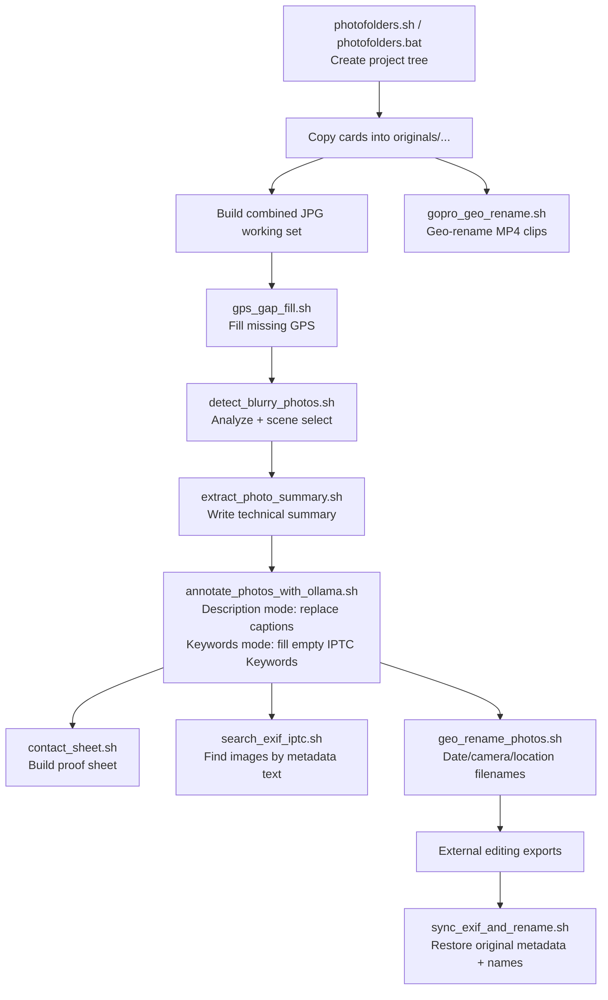

# PhotoShell
PhotoShell is a practical Bash toolkit for photographers who need fast, repeatable metadata workflows on local files.

It focuses on common archive-cleanup tasks such as repairing missing GPS tags, generating standardized metadata summaries, and renaming photos/videos into searchable, context-rich filenames.

The scripts are designed for batch processing in a working directory and are built around `exiftool` and a small set of standard CLI utilities.

**New here?** See the [Quick Start Guide](QSG.md) to get up and running in 10 minutes.

And in case you like photography, here are some of mine: https://fieldexposure.com/


## Example Workflow: Back From A Trip (Mixed GPS + Non-GPS Cameras)
Scenario:
- Cameras used: iPhone + DJI drone + GoPro (GPS-capable), Fujifilm X-T3 + Nikon D750 (limited/no GPS).
- Goal: keep untouched originals, build a working set, fill GPS gaps, cull, annotate, rename, and prepare exports.

```bash
# repo checkout location
PHOTOSHELL="$HOME/src/photoshell"

# project location
PROJECT="2026-02_iceland_ring_road"
ROOT="$HOME/Pictures/Photography"
PROJECT_DIR="$ROOT/$PROJECT"
```

1. Create the project folder tree.
```bash
bash "$PHOTOSHELL/scripts/photofolders.sh" "$PROJECT" --root "$ROOT"
# Windows alternative:
# scripts\photofolders.bat "%PROJECT%" --root "D:\Photos"
```

2. Ingest cards into `originals/...` folders (example copy targets).
```bash
rsync -av /media/cards/FUJI/ "$PROJECT_DIR/originals/photo_cameras/X-T3/photos/raw/"
rsync -av /media/cards/NIKON/ "$PROJECT_DIR/originals/photo_cameras/D750/photos/raw/"
rsync -av /media/phone/DCIM/ "$PROJECT_DIR/originals/cell_phones/iPhone/photos/jpg/"
rsync -av /media/dji/DCIM/ "$PROJECT_DIR/originals/drones/DJI/photos/jpg/"
rsync -av /media/gopro/DCIM/ "$PROJECT_DIR/originals/video_cameras/GoPro/videos/original/"
```

3. Build one JPEG working timeline across cameras (so GPS-capable files can donate coordinates).
```bash
mkdir -p "$PROJECT_DIR/processed/photos/working/all_cameras_jpg"
rsync -av "$PROJECT_DIR/originals/photo_cameras/X-T3/photos/jpg/" "$PROJECT_DIR/processed/photos/working/all_cameras_jpg/"
rsync -av "$PROJECT_DIR/originals/photo_cameras/D750/photos/jpg/" "$PROJECT_DIR/processed/photos/working/all_cameras_jpg/"
rsync -av "$PROJECT_DIR/originals/cell_phones/iPhone/photos/jpg/" "$PROJECT_DIR/processed/photos/working/all_cameras_jpg/"
rsync -av "$PROJECT_DIR/originals/drones/DJI/photos/jpg/" "$PROJECT_DIR/processed/photos/working/all_cameras_jpg/"
```

4. Fill missing GPS from nearest-in-time donor photos.
```bash
cd "$PROJECT_DIR/processed/photos/working/all_cameras_jpg"
bash "$PHOTOSHELL/scripts/gps_gap_fill.sh" --dry-run
bash "$PHOTOSHELL/scripts/gps_gap_fill.sh"
```

5. Cull blur and keep the sharpest frame per scene.
```bash
bash "$PHOTOSHELL/scripts/detect_blurry_photos.sh" \
  --mode all \
  --input "$PROJECT_DIR/processed/photos/working/all_cameras_jpg" \
  --analyzed-dir "$PROJECT_DIR/processed/photos/working/blur_analyzed" \
  --scenes-dir "$PROJECT_DIR/processed/photos/working/scenes" \
  --selected-dir "$PROJECT_DIR/processed/photos/working/selected" \
  --time-gap 8 \
  --visual-threshold 0.12 \
  --clean
```

6. Write concise EXIF/IPTC summaries, then enrich with Ollama (description and optional keywords workflows).
```bash
export GEOCODIO_API_KEY="YOUR_GEOCODIO_API_KEY"
find "$PROJECT_DIR/processed/photos/working/selected" -maxdepth 1 -type f \( -iname "*.jpg" -o -iname "*.jpeg" \) -print0 | \
  xargs -0 -I{} bash "$PHOTOSHELL/scripts/extract_photo_summary.sh" "{}"

bash "$PHOTOSHELL/scripts/annotate_photos_with_ollama.sh" \
  -r \
  --prompt-id 1 \
  -m gemma3:27b \
  "$PROJECT_DIR/processed/photos/working/selected"

# Optional: populate IPTC Keywords only where empty.
bash "$PHOTOSHELL/scripts/annotate_photos_with_ollama.sh" \
  --keywords \
  -r \
  --prompt-id 1 \
  -m gemma3:27b \
  "$PROJECT_DIR/processed/photos/working/selected"
```

7. Generate a proof sheet and search metadata text.
```bash
bash "$PHOTOSHELL/scripts/contact_sheet.sh" \
  -s "$PROJECT_DIR/processed/photos/working/selected" \
  -t 320 \
  --theme dark \
  -o "$PROJECT_DIR/processed/photos/exports/web/contact_sheet_trip.jpg"

bash "$PHOTOSHELL/scripts/search_exif_iptc.sh" \
  -q "waterfall" \
  -f "Caption-Abstract,UserComment,Keywords" \
  -m image \
  "$PROJECT_DIR/processed/photos/working/selected"

# Optional fuzzy matching with fzf:
bash "$PHOTOSHELL/scripts/search_exif_iptc.sh" \
  -q "watrfal" \
  --fzf \
  --fzf-cutoff 3 \
  "$PROJECT_DIR/processed/photos/working/selected"
```

8. Rename photos and GoPro videos with timestamp/location-rich names.
```bash
cd "$PROJECT_DIR/processed/photos/working/selected"
bash "$PHOTOSHELL/scripts/geo_rename_photos.sh" --structure daily --dry-run
bash "$PHOTOSHELL/scripts/geo_rename_photos.sh" --structure daily

cd "$PROJECT_DIR/originals/video_cameras/GoPro/videos/original"
bash "$PHOTOSHELL/scripts/gopro_geo_rename.sh"
```

9. After editing exports, sync metadata from originals and rename exports to source-aligned names.
```bash
bash "$PHOTOSHELL/scripts/sync_exif_and_rename.sh" \
  "$PROJECT_DIR/processed/photos/exports/full" \
  --orig-dir "$PROJECT_DIR/originals/photo_cameras/X-T3/photos/raw" \
  --dry-run

bash "$PHOTOSHELL/scripts/sync_exif_and_rename.sh" \
  "$PROJECT_DIR/processed/photos/exports/full" \
  --orig-dir "$PROJECT_DIR/originals/photo_cameras/X-T3/photos/raw"
```



## Web UI

PhotoShell includes an optional Flask-based web interface for workflow orchestration. Instead of running scripts individually from the command line, the web UI lets you configure, validate, and execute your entire photo workflow from a browser.

### Quick Start

```bash
cd ui/flask
pip install -r requirements.txt
python3 app.py
# Open http://localhost:5050
```

Use `--host` and `--port` to customize the bind address (e.g., `python3 app.py --port 8080`).

### Features

- **Sidebar + inspector layout** — select workflow steps in the sidebar, configure each step's options in the main panel
- **Folder browser** — navigate and select photo directories on the server via a built-in file browser modal
- **Folder validation** — verify directories exist, see photo counts, GPS coverage percentage, and metadata stats
- **Pipeline visualization** — watch workflow steps light up in real-time as they execute (pending → running → done/failed)
- **Step ordering validation** — warns if steps are in a suboptimal order (e.g., GPS Fill should run before Geo Rename)
- **Advisory pre-flight checks** — detects potential issues before execution (missing GPS, existing metadata that would be overwritten, etc.)
- **Ollama integration** — auto-discovers installed models, flags vision-capable models, validates that the Ollama server is running
- **Prompt management** — browse, preview, edit, and save prompts for the Ollama annotation workflows
- **Structured search** — discover available EXIF/IPTC fields from your photos, then search by numeric ranges (aperture, focal length, ISO), date ranges, camera model, lens, file type, keywords, and captions with PCRE regex support. Parallel exiftool processing for large collections. Paginated results with thumbnail prefetching.
- **Text search** — grep-style metadata search across files with field and media type filters, results shown as thumbnail grid with photo preview modal
- **Photo thumbnails** — browse photos as a lazy-loaded thumbnail grid with "Load more" pagination, click to preview full-size images
- **Streaming logs** — offset-based log streaming with line numbers, step header highlighting, and scroll-lock indicator
- **Metadata coverage** — shows GPS, Caption, UserComment, Keywords coverage, camera model breakdown, and date range with option to scan all files
- **Set GPS location** — geocode a place name via Geocod.io and write GPS coordinates to photos, with optional randomized spread within a radius (miles, km, yards, meters) for natural distribution
- **GPS map** — interactive Leaflet.js map with clustered markers colored by camera model, click markers for thumbnail + metadata popup (CartoDB dark tiles, vendored for offline use)
- **Blur comparison** — before/after slider comparing blurriest vs sharpest photos per scene, with filmstrip navigation and blur score badges
- **Content view tabs** — toggle between Thumbnails, Map, and Blur Comparison views
- **Workflow presets** — save, load, and delete named workflow configurations as JSON presets
- **Undo/revert** — restore metadata from exiftool `_original` backup files with one click
- **Multi-folder project mode** — auto-detect subfolders with photos, run the full pipeline across all subfolders sequentially, skip failures and continue
- **Photo catalog** — index EXIF/IPTC metadata from large photo collections into SQLite for instant searching. Build, update, prune, and remove catalogs from the UI. Structured filters (numeric ranges, date ranges, camera model dropdowns, keyword search) plus free-text search across all fields. Parallel exiftool workers with real-time progress bar. Now also indexes ImageDescription and UserComment fields.
- **AI search** — describe what you're looking for in plain language and Ollama generates search keywords + synonyms, then SQL matches them against your catalog metadata (descriptions, captions, headlines, keywords, locations). Four search modes: General, Mood/Atmosphere, Subject/Activity, and Location/Setting.
- **Metadata replace** — find and replace text across 20 EXIF/IPTC/XMP fields with keyword-aware handling, regex, case-insensitive matching, and field discovery
- **Copyright / Creator** — batch-write photographer name, copyright, email, website, credit, source to all photos with `%Y` year substitution
- **Consistency audit** — Ollama-powered detection of outliers in AI-generated descriptions (wrong event names, location mismatches, tone drift) with 4 selectable prompts
- **EXIF/IPTC viewer** — click any photo thumbnail to preview it, then view full EXIF or IPTC metadata in a scrollable table with one click
- **Drag-and-drop** — drop a folder onto the UI to set the photo directory
- **Contact sheet splitting** — automatically split large collections across multiple sheets (configurable max images per sheet)
- **Backup** — create timestamped `.tar.gz` archives with size estimation before running
- **Keyboard shortcuts** — `R` (run), `Esc` (cancel), `/` (focus path), `V` (validate), `?` (help)
- **Completion sounds** — audio notification on pipeline success or failure
- **Responsive** — works on desktop and mobile viewports

### Design

The UI follows a DaVinci Resolve-inspired dark pro-tool aesthetic with warm amber accents, Inter + JetBrains Mono typography, and an information-dense layout. See [`DESIGN.md`](DESIGN.md) for the full design system specification.

## Scripts
- [`scripts/photofolders.bat`](scripts/photofolders.bat): Create a standardized photo project folder tree (originals + processed) for multi-camera workflows.
- [`scripts/photofolders.sh`](scripts/photofolders.sh): Linux Bash version of `photofolders` with the same config-driven folder scaffold workflow.
- [`scripts/photofolders.config.cmd`](scripts/photofolders.config.cmd): External folder template used by `photofolders.bat` (categories, equipment, original subfolders, processed outputs).
- [`scripts/photofolders.config.sh`](scripts/photofolders.config.sh): Bash config used by `photofolders.sh` with the same folder model and variable naming.
- [`scripts/detect_blurry_photos.sh`](scripts/detect_blurry_photos.sh): Detect blur with ImageMagick, split photos into scenes by time gap plus visual similarity, and select the sharpest frame per scene.
- [`scripts/contact_sheet.sh`](scripts/contact_sheet.sh): Generate a contact/proof sheet from photos with metadata captions (IPTC Caption, EXIF UserComment, or EXIF summary fallback).
- [`scripts/gps_gap_fill.sh`](scripts/gps_gap_fill.sh): Fill in missing GPS coordinates by copying them from the nearest-in-time photo with geotags.
- [`scripts/gps_set_location.sh`](scripts/gps_set_location.sh): Geocode a location name via Geocod.io and write GPS coordinates to photos. Supports randomized spread within a radius (miles, km, yards, meters), file type filtering, and recursive scanning.
- [`scripts/extract_photo_summary.sh`](scripts/extract_photo_summary.sh): Extract key EXIF details, build a concise photo summary, and write it into comment/description metadata tags.
- [`scripts/annotate_photos_with_ollama.sh`](scripts/annotate_photos_with_ollama.sh): Run one Ollama workflow at a time: description mode replaces `EXIF:ImageDescription` and `IPTC:Caption-Abstract`, keywords mode populates empty `IPTC:Keywords`, headline mode populates empty `IPTC:Headline` (includes Adobe Stock-optimized title prompts). All workflows support prompt selection (`--list-prompts`, `--prompt-id`, `--prompt-file`).
- [`scripts/sync_exif_and_rename.sh`](scripts/sync_exif_and_rename.sh): Sync export JPEG metadata from matching originals and rename files back to source-aligned basenames.
- [`scripts/geo_rename_photos.sh`](scripts/geo_rename_photos.sh): Rename photos using capture timestamp, camera model, and reverse-geocoded location, with optional date-based folder structure.
- [`scripts/gopro_geo_rename.sh`](scripts/gopro_geo_rename.sh): Rename GoPro MP4 clips with capture time, reverse-geocoded location, duration, and original filename.
- [`scripts/search_exif_iptc.sh`](scripts/search_exif_iptc.sh): Search EXIF/IPTC metadata text across supported image/raw/video files with field, type, and recursion filters.
- [`scripts/scrub_selected_metadata.sh`](scripts/scrub_selected_metadata.sh): Clear selected EXIF/IPTC fields with optional exact tag selectors (`--exif`, `--iptc`) and recursion control.
- [`scripts/backup_folder.sh`](scripts/backup_folder.sh): Create timestamped `.tar.gz` archives of a photo directory with optional recursion.
- [`scripts/catalog_build.sh`](scripts/catalog_build.sh): Scan photo directories and index EXIF/IPTC metadata into SQLite for fast searching. Supports file type filtering, depth limiting, filename/folder patterns, and parallel exiftool workers. Four modes: build, update, prune, stats.
- [`scripts/metadata_replace.sh`](scripts/metadata_replace.sh): Find and replace text across 20 EXIF/IPTC/XMP metadata fields. Keyword-aware, regex support, case-insensitive matching, dry-run preview.
- [`scripts/metadata_copyright.sh`](scripts/metadata_copyright.sh): Batch-write photographer name, copyright notice (with `%Y` year substitution), email, website, credit, and source to IPTC/EXIF/XMP fields.
- [`scripts/metadata_consistency.sh`](scripts/metadata_consistency.sh): Ollama-powered consistency audit — reads all descriptions in a folder, detects outliers, and optionally fixes them. Four prompt modes: general, event/location, tone/style, hallucination detection.
- [`scripts/ai_search.prompts.txt`](scripts/ai_search.prompts.txt): Prompt templates for the AI Search feature — four modes (General, Mood/Atmosphere, Subject/Activity, Location/Setting) that guide keyword generation from natural-language queries.

## Documentation
- [`docs/photofolders.md`](docs/photofolders.md): `photofolders` behavior, rationale, usage, and workflow integration for Windows and Linux variants.
- [`docs/photofolders_config.md`](docs/photofolders_config.md): Detailed config schema/format for `photofolders.config.cmd` and `photofolders.config.sh` with examples and rules.
- [`docs/detect_blurry_photos.md`](docs/detect_blurry_photos.md): Blur detection workflow with ImageMagick, scene splitting logic, and best-frame selection usage.
- [`docs/contact_sheet.md`](docs/contact_sheet.md): Contact/proof sheet generation flow, geometry logic, metadata caption fallback, and usage examples.
- [`docs/gps_gap_fill.md`](docs/gps_gap_fill.md): Why this script exists, how it works, requirements, usage, and limitations.
- [`docs/extract_photo_summary.md`](docs/extract_photo_summary.md): Why this script exists, how metadata is summarized, geocoding behavior, requirements, usage, and limitations.
- [`docs/annotate_photos_with_ollama.md`](docs/annotate_photos_with_ollama.md): Ollama-driven metadata annotation with mutually exclusive description/keywords/headline workflows, input modes (`DIRECTORY`, `--file`, `--list`), prompt-file selection options, requirements, and safety notes.
- [`docs/sync_exif_and_rename.md`](docs/sync_exif_and_rename.md): Why this script exists, matching/metadata sync behavior, usage, safety, and limitations.
- [`docs/geo_rename_photos.md`](docs/geo_rename_photos.md): Why this script exists, how naming and folder structure work, requirements, usage, and limitations.
- [`docs/gopro_geo_rename.md`](docs/gopro_geo_rename.md): Why this script exists, how filename construction works, requirements, usage, and limitations.
- [`docs/search_exif_iptc.md`](docs/search_exif_iptc.md): EXIF/IPTC metadata search behavior, field/media filters, recursive control, and examples.
- [`docs/scrub_selected_metadata.md`](docs/scrub_selected_metadata.md): Metadata scrub behavior, default tags, exact EXIF/IPTC selector usage, recursion modes, and safety notes.

## Project

- [`QSG.md`](QSG.md): **Quick Start Guide** — install dependencies, clone, start the UI, and process your first photos in 10 minutes.
- [`ARCHITECTURE.md`](ARCHITECTURE.md): System overview, component diagram, design decisions, directory structure, and security model.
- [`DESIGN.md`](DESIGN.md): Design system specification — color palette, spacing, typography, component specs, interaction states.
- [`CONTRIBUTING.md`](CONTRIBUTING.md): Setup instructions, code style, testing approach, and how to submit changes.
- [`CHANGELOG.md`](CHANGELOG.md): Release history with user-facing feature descriptions.
- [`TODOS.md`](TODOS.md): Planned features, open work items, and completed milestones.
- [`SECURITY.md`](SECURITY.md): Vulnerability reporting policy.
