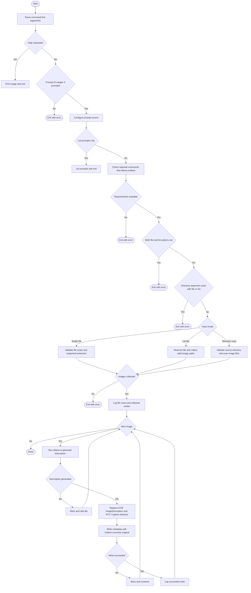

# annotate_photos_with_ollama.sh

`annotate_photos_with_ollama.sh` generates concise technical photo descriptions with Ollama and replaces specific metadata fields with the generated text.

## Why This Script Exists

Photo collections often have partial or inconsistent descriptive metadata.

This script automates dense, photography-focused annotation by generating a concise description per file and writing it into standard tags used by many photo tools.

## What The Script Does

For each selected image, it:

1. Runs `ollama run` with a prompt focused on technical photographic description and location-aware subject context.
2. Captures and normalizes the model output.
3. Replaces:
   - `EXIF:ImageDescription`
   - `IPTC:Caption-Abstract`
4. Does not modify `EXIF:UserComment`.
5. Writes metadata using `exiftool -overwrite_original`.

## Input Modes

Exactly one of these modes is used:

- directory scan (default): current directory or provided `DIRECTORY`
- single file: `--file <path>`
- list file: `--list <path>` (one file path per line)

Rules:

- `--file` and `--list` cannot be used together.
- `DIRECTORY` cannot be combined with `--file` or `--list`.
- `--recursive` is relevant only for directory mode.

## Prompt Selection

The script keeps a built-in fallback prompt and can also load prompts from:

- `scripts/annotate_photos_with_ollama.prompts.txt`

Prompt file format:

- One prompt per line: `<integer>|<prompt text>`
- Example: `1|Describe the image...`

Options:

- `--list-prompts`: list prompts from the prompt file and exit.
- `--prompt-id <id>`: choose a prompt by integer ID.
- `--prompt-id 0`: force built-in fallback prompt.
- `--prompt-file <path>`: use a custom prompt file.

## Requirements

- Bash
- `ollama`
- `exiftool`
- `find`

## Usage

Directory mode (current directory):

```bash
./scripts/annotate_photos_with_ollama.sh
```

Directory mode (recursive):

```bash
./scripts/annotate_photos_with_ollama.sh -r /photos/archive
```

Single file:

```bash
./scripts/annotate_photos_with_ollama.sh --file /photos/archive/img001.cr3
```

List file:

```bash
./scripts/annotate_photos_with_ollama.sh --list /photos/archive/file_list.txt
```

List prompts:

```bash
./scripts/annotate_photos_with_ollama.sh --list-prompts
```

Use prompt ID 1:

```bash
./scripts/annotate_photos_with_ollama.sh --prompt-id 1 -r /photos/archive
```

Custom model:

```bash
./scripts/annotate_photos_with_ollama.sh -m gemma3:12b -r /photos/archive
```

## Sample Output

Here's a sample contact sheet generated using the `./scripts/contact_sheet.sh` script after running `annotate_photos_with_ollama.sh` on a directory of photos. The descriptions generated by Ollama are visible in the metadata and can be displayed in photo management software that supports IPTC and EXIF fields.


## Workflow Diagram



## List File Format

- One path per line.
- Blank lines are ignored.
- Lines starting with `#` are treated as comments.
- Relative paths are resolved relative to the list file location.
- Missing or unsupported entries are skipped with warnings.

## Supported Image Extensions

`jpg`, `jpeg`, `jpe`, `png`, `tif`, `tiff`, `heic`, `heif`, `webp`, `bmp`, `gif`, `dng`, `arw`, `cr2`, `cr3`, `nef`, `nrw`, `orf`, `raf`, `rw2`, `pef`, `srw`, `x3f`

## Safety Notes

- Metadata writes use `exiftool -overwrite_original` (the original file is replaced).
- Repeated runs overwrite `EXIF:ImageDescription` and `IPTC:Caption-Abstract` with the latest generated text.
- `EXIF:UserComment` is intentionally left unchanged by this script.
- Test on a copy first if you need a reversible workflow.
