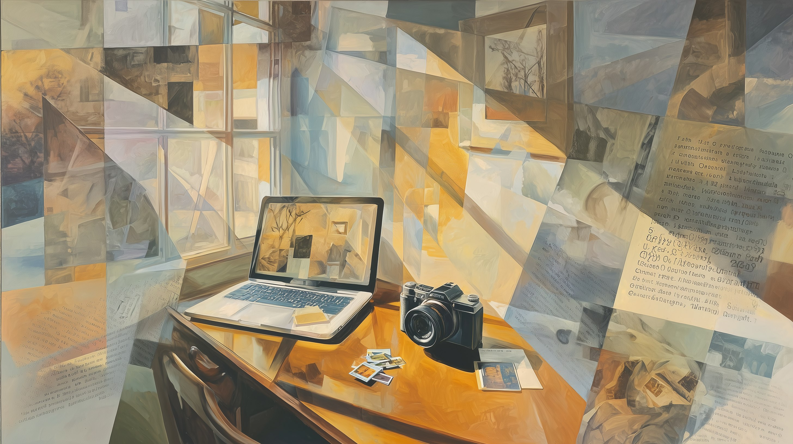
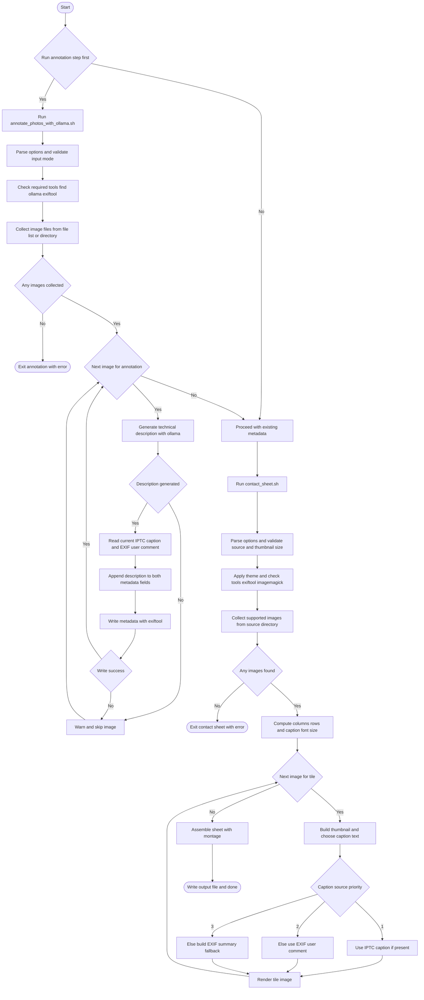

# contact_sheet.sh

`contact_sheet.sh` builds a contact/proof sheet from photos in a folder.

Each tile includes:

1. A thumbnail (long edge controlled by `--thumb-size`).
2. Caption from `IPTC:Caption-Abstract` when available.
3. Otherwise caption from `EXIF:UserComment`.
4. Otherwise a brief EXIF summary (`Model`, `Lens`, `FNumber`, `ExposureTime`, `ISO`, `FocalLength`, `DateTimeOriginal`/`CreateDate`).



## Why This Script Exists

Photo review and client proofing often needs one sheet that shows many frames plus useful notes.

This script automates both thumbnail layout and per-image caption extraction from embedded metadata.

## What The Script Does

1. Scans the source folder for supported image files.
2. Optionally scans subfolders (`--recursive`).
3. Applies a visual theme (`light` or low-contrast `dark`) to sheet and caption areas.
4. Builds one tile per image (thumbnail + caption block).
5. Scales caption font size from thumbnail size for better readability at larger thumbnail dimensions.
6. Computes sheet geometry (columns/rows) from thumbnail long-edge size and image count.
7. Prints progress updates during scan, tile generation, and final assembly.
8. Writes a single contact sheet image.

## Requirements

- Bash
- `exiftool`
- ImageMagick:
  - IM7: `magick`
  - or IM6: `convert` + `montage`
- Standard shell utilities: `find`, `sort`, `awk`, `sed`

## Sample

This is a sample contact sheet generated by the script from a folder of travel photos using the dark theme option:


## Usage

Default behavior (current folder, non-recursive, 256px thumbnails):

```bash
./scripts/contact_sheet.sh
```

Specify source folder, recursive scan, and custom thumbnail size:

```bash
./scripts/contact_sheet.sh -s /photos/wedding -r -t 320 -o wedding_proof.jpg
```

Non-recursive scan in a specific folder:

```bash
./scripts/contact_sheet.sh --source /photos/exports --no-recursive --thumb-size 192
```

Use the dark low-contrast theme:

```bash
./scripts/contact_sheet.sh -s /photos/exports -r -t 320 --theme dark -o proof_dark.jpg
```

## Unified Workflow Diagram



## Options

- `-s`, `--source DIR`: source folder (default: `.`).
- `-r`, `--recursive`: include subfolders.
- `-n`, `--no-recursive`: only the source folder (default).
- `-t`, `--thumb-size PX`: thumbnail long-edge size in pixels (default: `256`).
- `--theme NAME`: `light` or `dark` (default: `light`).
- `-o`, `--output FILE`: output contact sheet file (default: `contact_sheet.jpg`).
- `-h`, `--help`: show help text.

## Supported Image Types

- `jpg`, `jpeg`, `jpe`
- `tif`, `tiff`
- `png`
- `heic`, `heif`
- `webp`
- `bmp`
- `gif`

## Geometry Notes

The script derives geometry from the thumbnail long-edge size and number of images.

- Caption block height is auto-sized by ImageMagick so long captions are not cut off.
- Column count targets a balanced sheet aspect while respecting a max canvas width.
- Row count is derived from `ceil(image_count / columns)`.

The computed geometry is printed before rendering, for example:

```text
Contact sheet geometry: 6 columns x 4 rows
```

## Caption Typography

- Caption point size scales with thumbnail size using `thumb_size / 18`.
- Font size is clamped to a readable range of `11pt` to `24pt`.
- The chosen font size is printed before rendering.

## Progress Output

The script prints status lines so longer runs do not appear stuck. Typical output includes:

```text
Scanning source folder for images...
Building tiles...
  [17/220] IMG_4017.JPG
Assembling contact sheet...
Wrote contact sheet: contact_sheet.jpg
```

## Theme Notes

- `light`: neutral light gray sheet with white tile/caption backgrounds and dark text.
- `dark`: low-contrast dark gray sheet/tile/caption backgrounds with soft light-gray text, designed to keep thumbnail content visually dominant.
