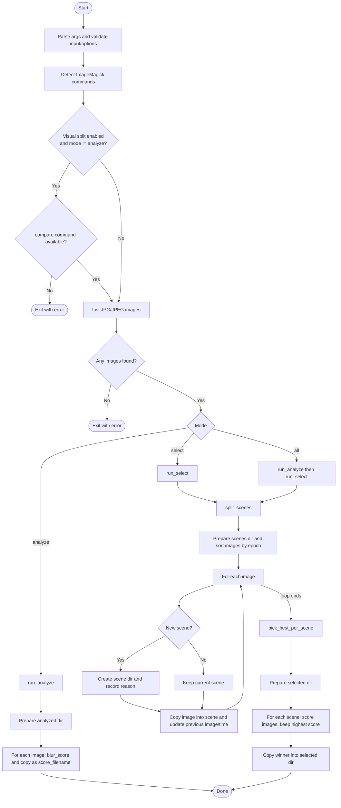

# detect_blurry_photos.sh

`scripts/detect_blurry_photos.sh` implements the blur-detection workflow from the assignment using ImageMagick.

It can:

- score JPG/JPEG sharpness with `-statistic StandardDeviation`
- copy scored files into an `analyzed` folder
- split photos into scenes by EXIF timestamp gaps plus visual similarity
- pick one sharpest photo per scene into a `selected` folder

## Requirements

- Linux Bash
- ImageMagick
  - IM7: `magick`
  - or IM6: `identify` + `convert` + `compare` (for visual scene split)
- common GNU tools: `find`, `sort`, `date`, `stat`

## Usage

```bash
scripts/detect_blurry_photos.sh [options]
```

Modes:

- `analyze`: score all images and copy as `<score>_<filename>`
- `select`: create scenes and select best from each scene
- `all`: run both (default)

Options:

- `-i, --input DIR`: input folder (default: `.`)
- `--analyzed-dir DIR`: output for analyzed files (default: `./analyzed`)
- `--scenes-dir DIR`: output for scenes (default: `./scenes`)
- `--selected-dir DIR`: output for selected files (default: `./selected`)
- `-t, --time-gap SECONDS`: new-scene threshold by EXIF time gap (default: `5`)
- `--no-visual`: disable visual similarity in scene split
- `--visual-threshold FLOAT`: visual-delta threshold for new scene (default: `0.10`)
- `--thumb-size PX`: normalized thumbnail size used for visual comparison (default: `256`)
- `-w, --window WxH`: ImageMagick window for blur metric (default: `5x5`)
- `-m, --mode MODE`: `analyze|select|all` (default: `all`)
- `--clean`: clear output folders before run
- `-n, --dry-run`: print actions only
- `-h, --help`: show help

## Examples

```bash
# Score and copy all JPEGs in current folder
scripts/detect_blurry_photos.sh --mode analyze --clean

# Split using both time and visual change
scripts/detect_blurry_photos.sh --mode select --time-gap 8 --visual-threshold 0.12 --clean

# Timestamp-only split (legacy behavior)
scripts/detect_blurry_photos.sh --mode select --time-gap 8 --no-visual --clean

# Full pipeline on a folder
scripts/detect_blurry_photos.sh --mode all --input "./trip_2026_02_14" --clean
```

## Workflow Diagram



## Notes

- Higher score means sharper image.
- Scene split uses timestamp and visual delta (`RMSE`) together by default.
- Timestamp extraction order: `EXIF:DateTimeOriginal`, then `EXIF:DateTime`, then file mtime fallback.
- The script only copies files; it does not edit metadata.
- For safety, non-empty output directories require `--clean`.
