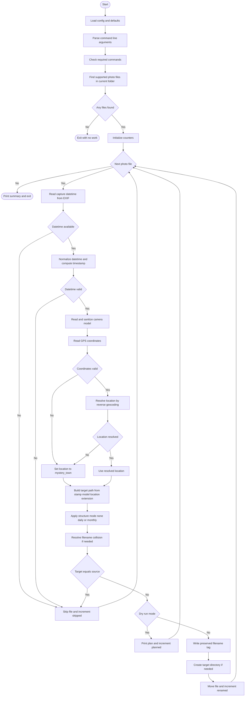

# geo_rename_photos.sh

`geo_rename_photos.sh` renames photo files into consistent, metadata-rich filenames using capture time, camera model, and reverse-geocoded location.

## Why This Script Exists

Camera filenames like `DSC01234.JPG` or `IMG_8472.HEIC` are not descriptive and become hard to manage in large archives.

This script solves that by embedding useful context directly into each filename so files are sortable and recognizable without opening them in a DAM tool.

It is especially useful when:

- photo sets come from multiple cameras and file naming conventions,
- location context matters for search and archival workflows,
- you want optional date-based folder structures without changing the actual image metadata.

## What The Script Does

For supported photo files in the current directory (non-recursive), the script:

1. Reads capture time (`DateTimeOriginal`, fallback `CreateDate`) with `exiftool`.
2. Reads camera model (`Model`) and normalizes it for safe filename use.
3. Reads GPS coordinates and reverse-geocodes them via geocod.io.
4. Falls back to `mystery_town` when location lookup is unavailable or fails.
5. Builds a target filename from timestamp + model + location.
6. Optionally moves files into date-based folders (`none`, `daily`, `monthly`).
7. Resolves name collisions by appending `-1`, `-2`, etc.

It also writes `XMP-xmpMM:PreservedFileName` with the prior base filename before moving/renaming.

## Filename Format

Output name pattern:

```text
YYYYMMDD-HHMMSS-<camera_model>-<location>.<ext>
```

Example:

```text
20240215-173045-sonya7iv-123_main_st_lake_city_co_81235.jpg
```

If metadata is missing:

- camera model fallback: `unknowncamera`
- location fallback: `mystery_town`

## Folder Structure Options

- `none` (default): keep files in current folder
- `daily`: `YYYY/YYYY-MM-DD`
- `monthly`: `YYYY/YYYY-MM`

## Requirements

- Bash with GNU-compatible `date -d`
- `exiftool`
- `curl`
- `jq`
- standard shell tools used by the script: `find`, `sed`, `grep`, `awk`
- Internet access for reverse geocoding (optional but recommended)

## Configuration

Set your geocod.io API key with environment variable:

```bash
export GEOCODIO_API_KEY="your_api_key_here"
```

If no API key is set, the script still runs and uses `mystery_town` for location.

## Usage

Run from the folder that contains the photos you want to process.

Dry run (recommended first):

```bash
./scripts/geo_rename_photos.sh --dry-run
```

Apply changes in place:

```bash
./scripts/geo_rename_photos.sh
```

Apply changes with daily folder structure:

```bash
./scripts/geo_rename_photos.sh --structure daily
```

## Workflow Diagram



## Safety Notes

- Renaming and moves are done in place.
- Always run `--dry-run` first to validate naming and folder outcomes.
- Keep a backup before batch rename/move operations.

## Known Limitations

- Non-recursive: scans only the current directory.
- Date parsing depends on GNU-style `date -d`.
- Geocoding quality depends on GPS precision and geocod.io coverage.
- Files without usable capture time are skipped.
