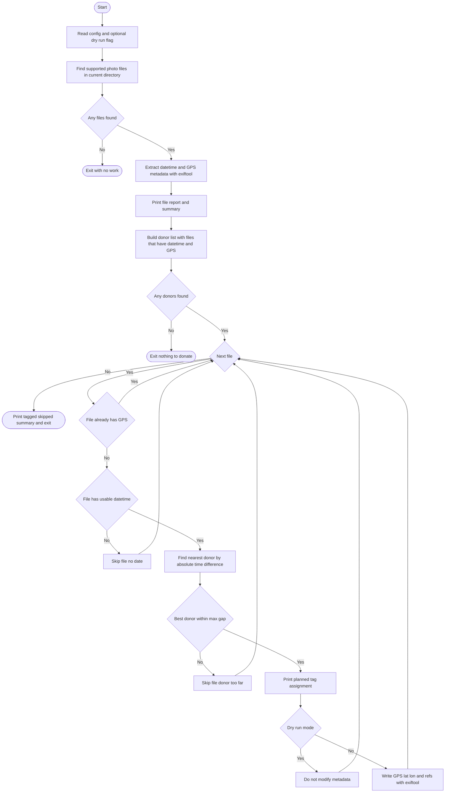

# gps_gap_fill.sh

`gps_gap_fill.sh` fills missing GPS metadata in photos by borrowing coordinates from the closest photo in time that already has valid geotags.

## Why This Script Exists

In real photo workflows, GPS data is often incomplete:

- Some cameras never write GPS.
- GPS devices lose signal indoors, in cities, or under heavy cloud cover.
- Mixed-camera shoots create gaps where only a subset of files has coordinates.

When timestamp metadata is present, nearby shots in time are often from the same location. This script uses that assumption to repair missing geotags quickly and consistently.

## What The Script Does

For photo files in the current directory (non-recursive), the script:

1. Reads capture time and GPS metadata with `exiftool`.
2. Builds a donor list of files that have both a timestamp and GPS.
3. For each file missing GPS, finds the donor with the smallest absolute time difference.
4. Writes donor coordinates only if the time gap is within `MAX_GAP` (default: `7200` seconds / 2 hours).
5. Prints a summary of tagged and skipped files.

It supports these extensions:

- `jpg`, `jpeg`
- `nef`, `cr2`, `cr3`, `arw`, `orf`, `rw2`, `rwl`, `srw`, `raf`, `dng`, `pef`

## Requirements

- Bash (GNU/Linux, WSL, macOS with GNU tools available)
- `exiftool`
- Standard shell utilities used by the script: `find`, `sort`, `sed`, `date`, `grep`

## Usage

Run from the folder that contains the photos you want to process.

Dry run (recommended first):

```bash
./scripts/gps_gap_fill.sh --dry-run
```

Apply changes:

```bash
./scripts/gps_gap_fill.sh
```

## Workflow Diagram



## Matching Rules

- Date priority:
  - `DateTimeOriginal`
  - fallback to `CreateDate`
- Donors must have both:
  - valid timestamp
  - valid GPS latitude and longitude
- Target files are skipped when:
  - they already have GPS
  - they have no usable timestamp
  - nearest donor is farther than `MAX_GAP`

## Safety Notes

- In normal mode, metadata is written with `exiftool -overwrite_original`.
- Always run `--dry-run` first to validate planned tag assignments.
- Back up your photo set before bulk metadata changes.

## Known Limitations

- Non-recursive: scans only the current directory (`find . -maxdepth 1`).
- `MAX_GAP` is fixed in the script (`7200`) and not currently exposed as a CLI argument.
- Nearest-in-time is a heuristic and can be wrong for multi-location shoots close in time.

## Practical Workflow

1. Copy target files into a working folder.
2. Run `--dry-run` and inspect `TAG` / `SKIP` output.
3. If matches look correct, run without `--dry-run`.
4. Verify resulting GPS tags in your DAM/editor (Lightroom, Photo Mechanic, etc.).
