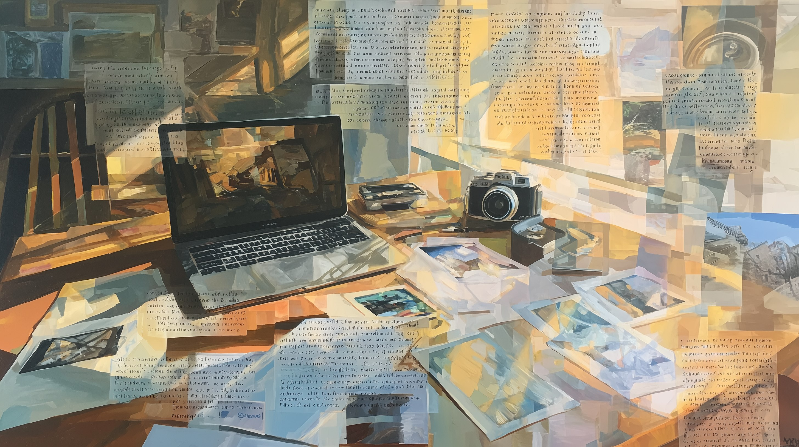

# metadata_consistency.sh

`metadata_consistency.sh` uses Ollama to audit descriptions across a photo set for consistency. It reads all captions/headlines, sends them to a vision LLM, and identifies outliers — wrong event names, location mismatches, tone drift, or factual contradictions.



## Why This Script Exists

When AI generates descriptions for hundreds of photos in a shoot, most will be correct — but a few will have errors. The AI might hallucinate a location name, use the wrong event name for a handful of photos, or produce descriptions with inconsistent tone.

Spotting these outliers manually across 200+ descriptions is tedious and error-prone. Humans are bad at consistency checking across large text sets. LLMs are good at it — they can read all descriptions at once and flag the ones that don't match the majority pattern.

## What The Script Does

**Pass 1: Scan & Extract**
1. Reads the target field (default: Caption-Abstract) from all matching files.
2. Collects non-empty values into a text corpus.

**Pass 2: Analyze with Ollama**
3. Sends the corpus to Ollama with a structured prompt asking it to identify inconsistencies.
4. Parses the JSON response (with cleanup for common LLM output issues).
5. Fuzzy-matches returned filenames to actual files on disk.
6. Reports findings or applies fixes.

## Requirements

- Bash (GNU/Linux, WSL, macOS with GNU tools)
- `exiftool`
- `ollama` (must be running: `ollama serve`)
- `python3`
- A vision or text model pulled in Ollama (e.g., `gemma3:27b`)

## Usage

```bash
# Basic audit — report inconsistencies in Caption-Abstract
metadata_consistency.sh /photos

# Audit Headlines instead
metadata_consistency.sh -F Headline /photos

# Audit and auto-fix
metadata_consistency.sh --fix /photos

# Preview fixes without writing
metadata_consistency.sh --fix -n /photos

# Use a different model
metadata_consistency.sh -m gemma3:12b /photos

# Recursive with file type filter
metadata_consistency.sh -r -t jpg,cr3 /photos
```

## Options

| Flag | Description | Default |
|------|-------------|---------|
| `-F, --field FIELD` | Field to audit | Caption-Abstract |
| `-m, --model NAME` | Ollama model | gemma3:27b |
| `--fix` | Auto-fix detected inconsistencies | report only |
| `-r, --recursive` | Include subfolders | off |
| `-t, --types EXT,...` | File extensions to process | all image types |
| `-n, --dry-run` | Preview fixes without writing | off |

## Supported Fields

- **Caption-Abstract** — IPTC caption (default, most common for AI-generated descriptions)
- **Headline** — IPTC headline
- **ImageDescription** — EXIF image description

Keywords are **not supported** — they are structured lists, not prose. Use `metadata_replace.sh` for keyword cleanup.

## Batching

For collections larger than 200 descriptions, the script splits the corpus into batches of 200 and processes each separately. A warning prints if the total exceeds 1000 descriptions, as accuracy may decrease with very large sets.

## Error Handling

- **Ollama unreachable:** Script aborts with a clear error message.
- **Timeout:** 120 seconds per batch. Timed-out batches are skipped with a warning.
- **Malformed JSON:** The script strips markdown code fences, fixes common issues, and retries line-by-line parsing. Completely unparseable responses are skipped.
- **Filename mismatches:** Ollama sometimes mangles filenames. The script tries case-insensitive matching and extension-stripped matching before giving up.

## Example Output

```
Metadata Consistency Audit
  Field:   Caption-Abstract
  Model:   gemma3:27b
  Mode:    report only

Files found: 200

Pass 1: Reading Caption-Abstract from 200 files...
Pass 1: Found 185 non-empty Caption-Abstract values out of 200 files
Pass 2: Analyzing consistency with gemma3:27b...

INCONSISTENCIES FOUND: 3

  ⚠ DSC_0023.jpg
    Issue: Event name mismatch — says "Sunset Festival" but 182 others say "Sunrise Festival"
    Current: "Crowds gathering at Sunset Festival in downtown Portland"
    Suggested: "Crowds gathering at Sunrise Festival in downtown Portland"

  ⚠ DSC_0089.jpg
    Issue: Location mismatch — says "Cape Hatteras" but others reference "Cape Lookout"
    Current: "Waves crashing at Cape Hatteras lighthouse"
    Suggested: "Waves crashing at Cape Lookout lighthouse"

  ⚠ DSC_0142.jpg
    Issue: Tone mismatch — uses third person while others use descriptive style
    Current: "The photographer captured a stunning sunset over the mountains"
    Suggested: "Stunning sunset over the mountains with golden light on the peaks"

Found 3 inconsistencies in 185 descriptions (1%)
Use --fix to apply suggested corrections, or --dry-run --fix to preview.

Done.
```

## Limitations

- **Text-only analysis.** The script sends text descriptions to Ollama, not the actual photos. This means it can catch textual inconsistencies (wrong names, locations, tone) but not visual ones (description says "sunset" but photo is actually a sunrise).
- **False positives are expected.** LLMs may flag legitimate stylistic differences as inconsistencies. The default report-only mode lets you review before applying.
- **Model quality matters.** Larger models (27b) produce more accurate results than smaller ones (4b). Use the largest model your GPU can handle.
- **Context window limits.** With very large batches, smaller models may truncate input. The 200-description batch limit helps, but some 4b models may still struggle.
