# photofolders (Windows + Linux)

`photofolders` creates a repeatable folder scaffold for a photo/video project.

Available variants:

- Windows CMD: `scripts/photofolders.bat` + `scripts/photofolders.config.cmd`
- Linux Bash: `scripts/photofolders.sh` + `scripts/photofolders.config.sh`

The script logic is intentionally generic. The actual folder model comes from an external config file.


## Why This Exists

Using a deterministic on-disk structure solves a different problem than a catalog app:

- predictable ingest targets before editing starts
- consistent archive layout across machines and teammates
- easier backups/sync to NAS/cloud because path conventions stay stable
- CLI-friendly workflows (`exiftool`, rename scripts, batch exports) without app lock-in
- portability even if you stop using one specific DAM app

This is not an anti-Lightroom approach. Lightroom is still great for culling/editing/catalog search. The folder scaffold is the storage contract underneath it.

## What It Creates

The script builds:

- `originals/<category>/<equipment>/...` trees from config
- `processed/...` trees from config

With the current default config, categories are:

- `cell_phones`
- `photo_cameras`
- `drones`
- `video_cameras`

## Usage

Windows:

```bat
scripts\photofolders.bat [project_name] [options]
```

Linux:

```bash
scripts/photofolders.sh [project_name] [options]
```

Options:

- `-p, --project NAME`: project name (if omitted, script prompts)
- `-r, --root PATH`: root archive folder
- `-c, --config PATH`: external template config file
- `-n, --dry-run`: print planned folders, do not create
- `-h, --help`: show help

Examples:

```bat
scripts\photofolders.bat "Iceland Trip 2026"
scripts\photofolders.bat --project "Wedding_Boston" --root "D:\Photos"
scripts\photofolders.bat "ClientA" --config "D:\Templates\photofolders.config.cmd"
scripts\photofolders.bat "ClientA" --dry-run
```

```bash
scripts/photofolders.sh "Iceland Trip 2026"
scripts/photofolders.sh --project "Wedding_Boston" --root "/mnt/photos"
scripts/photofolders.sh "ClientA" --config "/opt/templates/photofolders.config.sh"
scripts/photofolders.sh "ClientA" --dry-run
```

## Unified Workflow Diagram

```mermaid
flowchart TD
    A([Start]) --> B{Script variant}
    B -->|Windows| C[Run photofolders.bat]
    B -->|Linux| D[Run photofolders.sh]
    C --> E[Parse arguments]
    D --> E

    E --> F{Help requested}
    F -->|Yes| G[Print usage and exit]
    F -->|No| H[Resolve root directory]
    H --> I{Root provided by option}
    I -->|Yes| J[Use provided root]
    I -->|No| K{PHOTOSHELL_ROOT set}
    K -->|Yes| L[Use PHOTOSHELL_ROOT]
    K -->|No| M[Use platform default root]
    J --> N[Resolve config path]
    L --> N
    M --> N

    N --> O{Config provided by option}
    O -->|Yes| P[Use provided config file]
    O -->|No| Q[Use platform default config file]
    P --> R[Load config and validate required variables]
    Q --> R
    R --> S{Config valid}
    S -->|No| Z1([Exit with error])
    S -->|Yes| T{Project name provided}
    T -->|No| U[Prompt for project name]
    T -->|Yes| V[Use project name]
    U --> W{Project name now set}
    W -->|No| Z2([Exit with usage error])
    W -->|Yes| V

    V --> X[Validate project name segment]
    X --> Y{Project name valid}
    Y -->|No| Z3([Exit with error])
    Y -->|Yes| AA[Set base directory root plus project]

    AA --> AB[Build tree from config]
    AB --> AC[Add originals directory]
    AC --> AD[Loop categories from CFG_CATEGORY_IDS]
    AD --> AE[Add originals category path]
    AE --> AF[Loop category equipment names]
    AF --> AG[Validate equipment name]
    AG --> AH[Add equipment directory]
    AH --> AI[Loop category subfolders and add each]
    AI --> AF
    AF --> AJ[After categories add processed directory]
    AJ --> AK[Loop processed subfolders and add each]

    AK --> AL{For each directory add request}
    AL -->|Exists| AM[Print exists and increment existing counter]
    AL -->|Dry run| AN[Print plan and increment created counter]
    AL -->|Create| AO[Create directory and increment created counter]
    AO --> AP{Create succeeded}
    AP -->|No| Z4([Exit with error])
    AP -->|Yes| AQ[Continue]
    AM --> AQ
    AN --> AQ
    AQ --> AR{More directories pending}
    AR -->|Yes| AL
    AR -->|No| AS[Print final summary]
    AS --> AT([Done])
```



## Defaults

Root path lookup order:

1. `--root`
2. `PHOTOSHELL_ROOT`
3. platform default:
   - Windows: `%USERPROFILE%\Pictures\Photography`
   - Linux: `$HOME/Pictures/Photography`

Default config:

- Windows: `scripts\photofolders.config.cmd` (same directory as `photofolders.bat`)
- Linux: `scripts/photofolders.config.sh` (same directory as `photofolders.sh`)

## Validation And Safety

Rejected project names:

- empty values
- `.` or `..`
- any value containing `\ / : * ? < > |`

The script only creates directories. It does not move, rename, or delete media.

## Config Format

Configuration is code (CMD or Bash) that sets variables. The script executes/sources that file at runtime.

Detailed format reference:

- [`docs/photofolders_config.md`](photofolders_config.md)

## Practical Workflow

Typical flow:

1. Create project skeleton with `photofolders.bat` or `photofolders.sh`.
2. Copy camera cards into `originals/...`.
3. Run metadata/rename scripts from this repo.
4. Export derivatives into `processed/...`.
5. Optionally import project into Lightroom/Bridge/C1 using this same structure.
