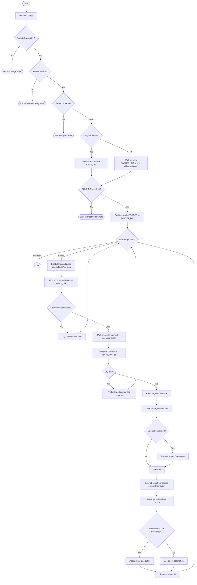

# sync_exif_and_rename.sh

`sync_exif_and_rename.sh` repairs exported JPEG metadata by copying EXIF from matching source files in your originals archive, then renames exports to the original base filename.


## Why This Script Exists

Many edit/export workflows produce files with:

- stripped or inconsistent metadata,
- tool-generated suffixes like `-edit`, `-hdr`, `-2x`,
- names that no longer match archive originals.

That makes DAM import, search, and long-term organization harder. This script restores metadata consistency and normalizes filenames so exports align with their source material.

## What The Script Does

For `jpg`/`jpeg` files in the given target folder (non-recursive), the script:

1. Builds candidate source stems by stripping common editor/upscale suffixes.
2. Finds matching original files in the originals directory.
3. Prefers raw-like formats first when multiple matches exist (`NEF`, `CR3`, `ARW`, etc.).
4. Clears target metadata, preserves current orientation, then copies EXIF from the chosen source.
5. Aligns file mtime with the source file timestamp.
6. Renames the target to `<original_stem>.jpg` and resolves collisions with `_1`, `_2`, etc.

## Originals Directory Resolution

The script can locate originals in two ways:

- explicit: `--orig-dir /path/to/originals`
- automatic: walk up from target folder and pick the first sibling directory named `originals`

Auto-discovery works well with project layouts where `processed/...` and `originals/...` share the same root.

## Requirements

- Bash
- `exiftool`
- Standard shell utilities used by the script: `find`, `touch`, `mv`, `realpath`

## Usage

Dry run first:

```bash
./scripts/sync_exif_and_rename.sh /path/to/processed/exports --dry-run
```

Apply changes with auto-detected originals:

```bash
./scripts/sync_exif_and_rename.sh /path/to/processed/exports
```

Apply changes with explicit originals directory:

```bash
./scripts/sync_exif_and_rename.sh /path/to/processed/exports --orig-dir /path/to/originals
```

## Workflow Diagram



## Safety Notes

- Metadata changes and renames are in place.
- Run `--dry-run` before write mode.
- Keep a backup before batch processing.

## Known Limitations

- Non-recursive: only scans the target folder itself.
- Matching is stem-based; unusual naming patterns may require manual cleanup.
- Depends on EXIF/metadata presence in source files for best results.
