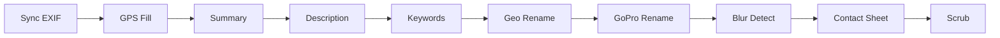

# PhotoShell Web UI

The PhotoShell web interface lets you configure, validate, and run your photo processing workflow from a browser — no command line needed.

## Quick Start

1. Set the **Target Folder** to a directory containing photos
2. Click the **validate** button (checkmark) to confirm the folder exists and has photos
3. **Enable workflow steps** by checking them in the sidebar
4. Click **Run Pipeline** (or press `R`)

## Layout

The UI has three areas:

- **Sidebar** (left) — folder path, step checklist, Run/Validate buttons, presets, shortcuts
- **Inspector** (center) — configuration options for the selected step
- **Pipeline strip** (top of inspector) — visual progress of running steps

Click any step name in the sidebar to see its configuration options in the inspector panel.

## Workflow Steps

Steps run in the order shown. Enable only the steps you need.

| Step | What it does |
|------|-------------|
| **Sync EXIF & Rename** | Copies metadata from original RAW files to exported JPEGs |
| **GPS Gap Fill** | Fills missing GPS coordinates from the nearest photo that has them |
| **Extract Photo Summary** | Writes a concise technical summary (camera, lens, ISO, location) to metadata |
| **Annotate - Description** | Uses Ollama to generate a natural-language description of each photo |
| **Annotate - Keywords** | Uses Ollama to generate searchable IPTC keywords for each photo |
| **Detect Blurry Photos** | Measures sharpness, groups photos into scenes, selects the sharpest per scene |
| **Geo Rename Photos** | Renames files to `YYYYMMDD-HHMMSS-camera-location.ext` using GPS data |
| **GoPro Geo Rename** | Same naming pattern for GoPro MP4 clips |
| **Contact Sheet** | Generates a proof sheet image with thumbnails and metadata captions |
| **Scrub Metadata** | Clears selected EXIF/IPTC fields (destructive — use with care) |

## Step Ordering

PhotoShell validates step order automatically. If steps are in a suboptimal order (e.g., Geo Rename before GPS Fill), a warning appears with a **Reorder** button to fix it.

The recommended order follows a logical pipeline: sync metadata first, fill GPS gaps, enrich with summaries and AI annotations, then rename and produce outputs.

## Ollama Integration

The **Annotate - Description** and **Annotate - Keywords** steps use [Ollama](https://ollama.com) to analyze photos with a local vision model.

- The **Model** dropdown auto-discovers installed Ollama models
- **Vision models** (those with image understanding) are shown first with a "recommended" label
- The preflight check verifies that `ollama serve` is running before execution
- **Prompts** can be browsed, previewed, edited temporarily, or saved to the prompts file

## Validation & Pre-Flight

Before running, click **Validate** to check:

- **Tool check** — are exiftool, ImageMagick, Ollama, curl, jq installed?
- **Advisory checks** — do photos have GPS? Are metadata fields already populated? Will data be overwritten?
- **Step order** — are steps in a logical sequence?

## Search EXIF / IPTC

The search panel (below the inspector) lets you search metadata text across all photos in a directory. You can filter by:

- **Fields** — all, EXIF only, or IPTC only
- **Media types** — image, RAW, or video
- **Recursive** — include subdirectories
- **Fuzzy matching** — tolerates typos (requires `fzf`)

Matching files can optionally be copied to another directory.

## Backup

Create a timestamped `.tar.gz` archive of the photo directory before processing. The **Estimate** button shows the archive size and available disk space before running.

## Keyboard Shortcuts

| Key | Action |
|-----|--------|
| `R` | Run the pipeline |
| `Esc` | Cancel a running pipeline |
| `/` | Focus the folder path input |
| `V` | Validate the workflow |
| `?` | Show this help |

Shortcuts are disabled when a text field is focused.

## Design

The UI follows a DaVinci Resolve-inspired dark aesthetic. See [DESIGN.md](https://github.com/igoros777/photoshell/blob/main/DESIGN.md) for the full design system specification.
