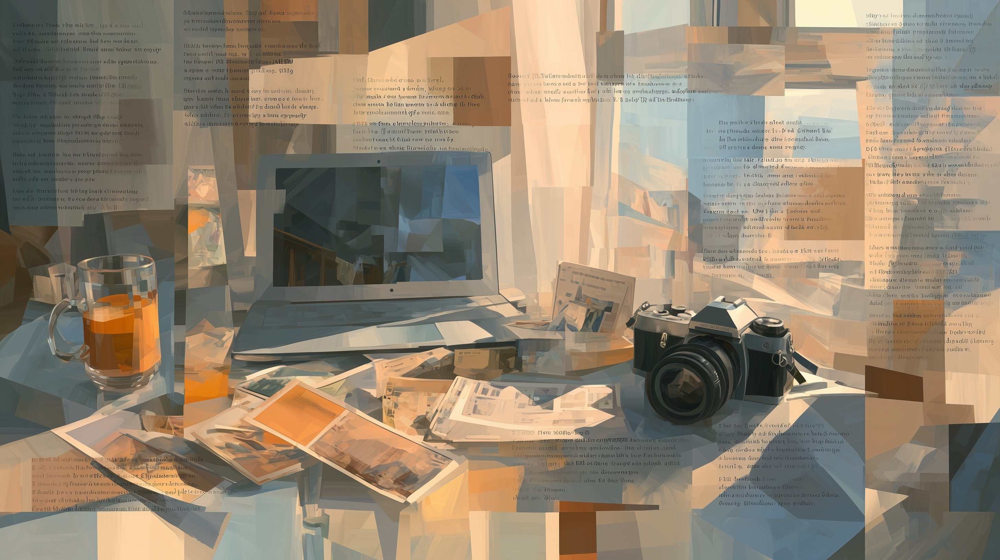
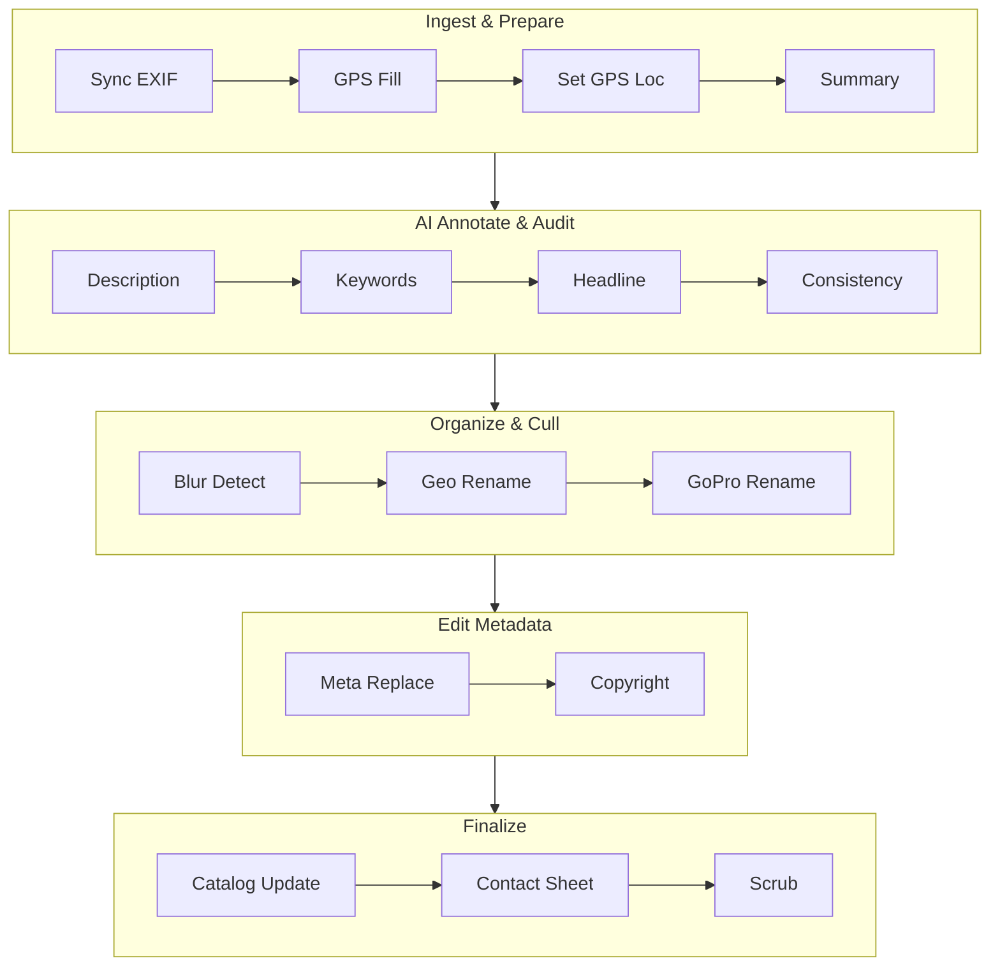

# PhotoShell Web UI

The PhotoShell web interface lets you configure, validate, and run your photo processing workflow from a browser — no command line needed.

## Quick Start

1. Set the **Target Folder** to a directory containing photos
2. Click the **validate** button (checkmark) to confirm the folder exists and has photos
3. **Enable workflow steps** by checking them in the sidebar
4. Click **Run Pipeline** (or press `R`)

## Layout

The UI has three areas:

- **Sidebar** (left) — folder path, step checklist, Run/Validate buttons, presets, shortcuts
- **Inspector** (center) — configuration options for the selected step
- **Pipeline strip** (top of inspector) — visual progress of running steps

Click any step name in the sidebar to see its configuration options in the inspector panel.

## Workflow Steps

Steps run in the order shown. Enable only the steps you need.

| Group | Step | What it does |
|-------|------|-------------|
| **Ingest & Prepare** | Sync EXIF & Rename | Copies metadata from original RAW files to exported JPEGs |
| | GPS Gap Fill | Fills missing GPS coordinates from the nearest photo that has them |
| | Set GPS Location | Geocodes a place name and writes GPS coordinates (with optional spread radius) |
| | Extract Photo Summary | Writes a concise technical summary (camera, lens, ISO, location) to metadata |
| **AI Annotate & Audit** | Annotate - Description | Uses Ollama to generate a natural-language description of each photo |
| | Annotate - Keywords | Uses Ollama to generate searchable IPTC keywords for each photo |
| | Annotate - Headline | Uses Ollama to generate a short headline for IPTC Headline field |
| | Consistency Audit | Ollama-powered detection of outliers in descriptions (wrong names, locations, tone) |
| **Organize & Cull** | Detect Blurry Photos | Measures sharpness, groups photos into scenes, selects the sharpest per scene |
| | Geo Rename Photos | Renames files to `YYYYMMDD-HHMMSS-camera-location.ext` using GPS data |
| | GoPro Geo Rename | Same naming pattern for GoPro MP4 clips |
| **Edit Metadata** | Metadata Replace | Find and replace text across 20 EXIF/IPTC/XMP fields with keyword-aware handling |
| | Copyright / Creator | Batch-write photographer name, copyright, email, website, credit, source |
| **Finalize** | Update Catalog | Keeps the SQLite catalog in sync — creates, prunes, and indexes in one step |
| | Contact Sheet | Generates a proof sheet image with thumbnails and metadata captions |
| | Scrub Metadata | Clears selected EXIF/IPTC fields (destructive — use with care) |

## Step Ordering

Steps are organized into five groups in the sidebar. PhotoShell validates step order automatically. If steps are in a suboptimal order (e.g., Geo Rename before GPS Fill), a warning appears with a **Reorder** button to fix it.

The recommended order follows a logical pipeline: ingest and prepare metadata first, then AI annotation and auditing, then organize and cull, then manual metadata editing, and finally catalog/output steps.

## Ollama Integration

The **Annotate - Description**, **Annotate - Keywords**, **Annotate - Headline**, and **Consistency Audit** steps use [Ollama](https://ollama.com) to analyze photos with a local vision model.

- The **Model** dropdown auto-discovers installed Ollama models
- **Vision models** (those with image understanding) are shown first with a "recommended" label
- The preflight check verifies that `ollama serve` is running before execution
- **Prompts** can be browsed, previewed, edited temporarily, or saved to the prompts file

## Validation & Pre-Flight

Before running, click **Validate** to check:

- **Tool check** — are exiftool, ImageMagick, Ollama, curl, jq installed?
- **Advisory checks** — do photos have GPS? Are metadata fields already populated? Will data be overwritten?
- **Step order** — are steps in a logical sequence?

## Photo Browsing

After validating a folder, photos appear as a **thumbnail grid** with lazy loading and "Load more" pagination. Three content view tabs let you switch between:

- **Thumbnails** — browse photos visually, click to preview
- **Map** — GPS locations on a dark CartoDB map with clustered markers colored by camera model
- **Blur Comparison** — before/after slider comparing blurriest vs sharpest photos (available after running Blur Detect)

## Photo Preview Modal

Click any thumbnail to open a full-size preview. The modal header has four buttons:

- **Rotate** — counterclockwise 90° rotation with auto-scaling
- **EXIF** — view full EXIF metadata in a scrollable table
- **IPTC** — view full IPTC metadata in a scrollable table
- **Download** — download the original full-resolution file

The footer shows the full file path and any available metadata (camera, lens, date, aperture, ISO, GPS, headline, caption, keywords).

## Workflow Presets

Save your current step configuration as a named preset for reuse:

- **Save** — click the floppy icon next to the preset dropdown, enter a name
- **Load** — select a preset from the dropdown to fill all step settings
- **Delete** — click the trash icon to remove the selected preset

Presets are stored as JSON files in `.photoshell/presets/`.

## Undo / Revert

After running metadata-modifying steps, an **Undo** button appears in the sidebar. Click it to restore metadata from exiftool's `_original` backup files.

## Search

The search panel has four tabs:

### Structured Search
Discover available EXIF/IPTC fields from your photos, then filter by numeric ranges, date ranges, camera model, lens, file type, keywords, and captions. Results appear as a thumbnail grid with pagination.

### Text Search
Grep-style metadata search with field and media type filters. Press Enter in the query field to search. An elapsed time indicator shows on the button during search.

### Catalog
Build a SQLite index of EXIF/IPTC metadata for instant searching across large collections. Supports build, update, prune, and remove operations. Includes both quick search (free text across all fields) and structured filters (same layout as the Structured tab). See the **Catalog** section below.

### AI Search
Semantic search powered by Ollama. Describe what you're looking for in natural language (e.g., "photos of children playing on a beach at sunset") and Ollama generates search keywords and synonyms from your description, then SQL matches them across all catalog text fields (ImageDescription, UserComment, Caption, Headline, Keywords, location). Requires a catalog and a running Ollama server. Four search modes: General, Mood/Atmosphere, Subject/Activity, and Location/Setting. Results ranked by keyword match count with a 1-10 relevance score and metadata snippets. The generated keywords are displayed so you can see exactly what was searched.

## Photo Catalog

For large photo collections (thousands of files), the Catalog tab provides instant metadata search via a SQLite index:

1. Enter a directory and click **Build** to index all photos
2. A progress bar shows real-time indexing status
3. Use **quick search** for free-text queries or **Discover Fields** for structured filters
4. **Update** adds new files incrementally, **Prune** removes entries for deleted files

## Drag-and-Drop

Drop a folder from your file manager onto the UI to set the photo directory. A full-page overlay with a dashed border appears while dragging.

## Multi-Folder Project Mode

When you select a folder that contains subfolders with photos, PhotoShell auto-detects them. The pipeline runs across all subfolders sequentially, skipping failures and continuing with the rest.

## Backup

Create a timestamped `.tar.gz` archive of the photo directory before processing. The **Estimate** button shows the archive size and available disk space before running.

## Keyboard Shortcuts

| Key | Action |
|-----|--------|
| `R` | Run the pipeline |
| `Esc` | Cancel a running pipeline |
| `/` | Focus the folder path input |
| `V` | Validate the workflow |
| `?` | Show this help |

Shortcuts are disabled when a text field is focused.

## Other Controls

- **Reset** button (below Validate) — resets all workflow settings to defaults
- Clicking a sidebar step again closes its inspector panel
- Clicking outside the inspector panel closes it

## Design

The UI follows a DaVinci Resolve-inspired dark aesthetic. See <a href="#" class="docs-internal-link" data-doc="design_system">DESIGN.md</a> for the full design system specification.
